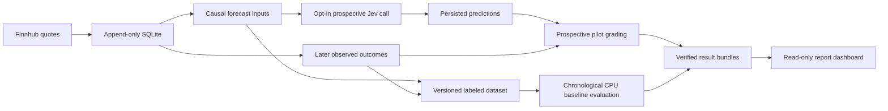
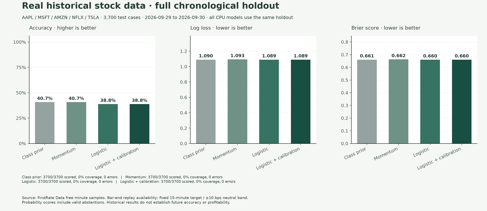
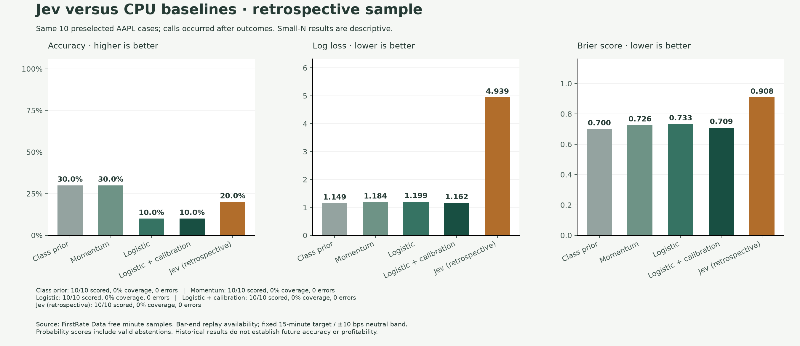
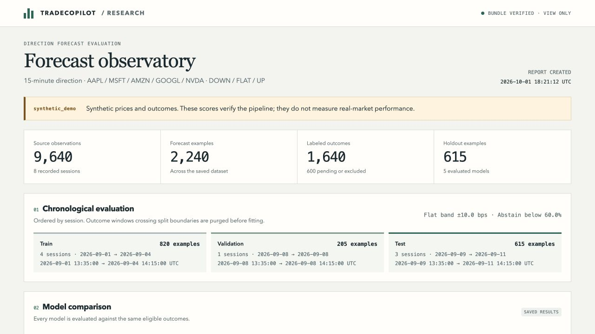

# TradeCopilot — Jev forecasting and evaluation

TradeCopilot combines a price-forecasting research pipeline with a deterministic
terminal monitor and local visual desk for the Ross first-pullback momentum
setup. The forecasting workflow records market observations, builds causal
features, compares CPU baselines, and evaluates opt-in Jev forecasts against
subsequently observed outcomes. It is analysis software: it never places,
previews, modifies, replaces, or cancels an order.

[](https://github.com/Vajraaaang/tradecopilot/actions/workflows/ci.yml)

## Project overview

| Workflow | Purpose | Outputs |
| --- | --- | --- |
| Jev market opinion | Interpret available intraday market context in the visual desk | BUY / HOLD / SELL / WAIT judgments, class probabilities, confidence, source time and usage |
| Jev prospective forecast | Predict a defined future price direction before its target time | Persisted UP / FLAT / DOWN probabilities, abstention status, request provenance and later outcome labels |
| Offline evaluation | Compare models on a chronological holdout without paid inference | CPU model artifacts, calibration and coverage diagnostics, quality metrics and verified report bundles |
| Deterministic strategy desk | Apply the existing momentum rules to replay or supported live evidence | Watch, entry, hold, exit-warning and reentry analysis states, risk plans and journal entries |

The AI engineering work includes API integration, causal data preparation,
baseline model training, evaluation, inference controls, reproducible artifacts,
operational telemetry, and containerized execution. Jev is accessed through its
hosted API; the learned local baseline is logistic regression.

### Implemented components

| Component | Implementation |
| --- | --- |
| Typed inference | Pinned `jev-1.13.0`, structured choice responses, finite normalized probabilities, model/prompt versions, and label-free requests |
| Inference controls | Shared persistent 100-attempt ledger, 30-second cooldown/cache, atomic per-run limits of 10 attempts and $0.05, conservative failed-call reservations, and zero automatic Jev retries |
| Durable market data | Finnhub last-price observations in append-only SQLite, exact deduplication, provider and receipt timestamps, and restart-aware request pacing |
| Causal features | 1- and 5-minute returns, 5-minute range and return volatility, change from previous close, source age and history count |
| Outcome labeling | Default 15-minute horizon, fixed ±10 bps FLAT band, bounded outcome receipt window, and XNYS holiday/DST/early-close checks |
| CPU baselines | Training-class prior, momentum-bucket frequencies, class-balanced logistic regression, and a validation-calibrated logistic variant |
| Evaluation | Whole-session chronological splits, purged overlapping label windows, training-only scaling, validation-only temperature selection, and untouched test scoring |
| Diagnostics | Accuracy, macro F1, log loss, Brier score, confusion matrix, per-class reliability, coverage/selective accuracy, per-symbol results, errors, latency and cost |
| Reproducibility | Hashed datasets/configurations, stable input identities, source/dependency fingerprints, immutable result bundles and JSON model export |
| Report application | Saved-result dashboard with model/class/symbol filters, prediction-versus-actual examples, provenance labels and integrity-backed health |
| Delivery and testing | Python wheel/sdist, unprivileged Docker image, Compose, and GitHub Actions tests plus a container check with external networking disabled |

### Forecast data flow



Jev receives only the original causal inputs. Outcome labels are joined after
their target times. Dataset examples and predictions retain their original
identities so the later labels cannot rewrite what was known at inference time.

## Real historical results

The next [selective-accuracy experiment](docs/selective-accuracy.md) adds free
Alpaca historical-data import, chronological CPU tuning, independent calibration
and a held-out final test. The 80% selective target includes minimum coverage and
separate UP/DOWN precision requirements. The real 103-session run selected OHLCV
logistic C=0.01: 46.51% final-test accuracy versus 46.18% for the price-only control
on 18,500 cases. No gate met the 80% target; the research policy abstains.
No Jev gain or production promotion is claimed.


The subsequent [OHLCV development milestone](docs/ohlcv-development.md) preserves
all bar fields, adds 55 causal features and a histogram-boosting comparator, and
compares five fixed CPU arms on validation only. Unweighted price-only logistic
scored 45.35% versus 42.03% for the balanced control on those validation sessions;
the richer models did not win. This is development evidence, with no new Jev
calls or default promotion. The earlier test results below remain unchanged.

The [historical evaluation](docs/historical-evaluation.md) ran on FirstRate Data's
free AAPL, MSFT, AMZN, NFLX and TSLA minute samples: 19,500 regular-session
observations and 18,500 labeled examples, with 3,700 chronological test cases.
The fixed 15-minute target and 0.6 confidence threshold were preserved.

The results are weak. The class prior scored 40.7% argmax accuracy, while logistic
regression scored 38.8%. On ten preselected AAPL cases, retrospective Jev scored
20%, versus 30% for the class prior on the same cases. Every model abstained at
the fixed threshold, yielding zero coverage. Jev used an estimated $0.000304878.





See the study for calibration/confusion plots, all recorded Jev probabilities,
source hashes, adjustment/receipt assumptions, per-symbol aggregate results and
reproduction commands. The raw provider files remain local; published assets
contain derived results with [FirstRate Data](https://firstratedata.com) attribution.
These historical results establish neither future accuracy nor profitability.

## Forecast dashboard



This screenshot shows the offline synthetic demonstration. The application
also displays recorded prospective pilots with their own evidence label.
Neither synthetic scores nor a three-case pilot establish real-market accuracy.

## Forecasting quick start

Run the complete synthetic demonstration without credentials or API charges:

```bash
uv sync --frozen
uv run tradecopilot forecast demo --output-dir .tradecopilot/forecast/demo
uv run tradecopilot forecast serve .tradecopilot/forecast/demo/run/report.json --open
```

The report compares training-class prior, momentum, logistic regression, and
validation-calibrated logistic regression on a chronological holdout. The optional
Jev contract fixture is a **local stub**, visibly labeled as such. Synthetic
results demonstrate the software workflow and are not real-market performance.

The forecast target is **UP / FLAT / DOWN after 15 minutes**, with a fixed ±10
basis-point neutral band. This gives the model a measurable outcome; the existing
BUY / HOLD / SELL market-opinion panel remains a separate informational feature.
The new report shows probability quality, coverage, abstentions, failures,
latency, cost estimates, and prediction-versus-outcome examples.

Features include durable SQLite collection, exchange-calendar session checks,
event/receipt timestamp separation, immutable hashed datasets and run artifacts,
JSON model export, per-class reliability diagrams, and a read-only report server.
CPU preprocessing fits on training data; temperature calibration fits only on
validation data. The test split does not select thresholds or model parameters.

For real data collection, guarded Jev pilots, Docker, and evaluation limitations,
see [the forecasting guide](docs/forecasting.md). No model has demonstrated
profitable trading or generalizable market accuracy in this repository.
The [validation snapshot](docs/validation-2026-10-01.md) records executed checks
and the limits of the small prospective pilot.

### Executed validation

| Check | Recorded result |
| --- | --- |
| Local regression suite | 455 tests passed after the historical extension |
| Static analysis | Ruff passed; strict mypy passed on 57 source files |
| Clean runtime | Docker served the synthetic report as UID 10001 with external networking disabled |
| Package delivery | Wheel and source distribution built; dashboard asset verified in the wheel |
| Browser | Report rendering, diagnostic selectors and filters verified without observed console errors |
| Offline dataset | 9,640 synthetic observations, 2,240 examples, 1,640 labeled outcomes, and 615 test examples across eight sessions |
| Live Jev integration pilot | Three forecasts joined to three later outcomes; two abstentions, no inference errors; estimated cost $0.000093198 |

These are the dated results recorded in the validation snapshot. The CI badge
links to current checks. The live pilot used 2,219 input tokens; a multi-session
held-out real-market evaluation is still needed before any predictive-performance
claim.

### Documentation and source map

- [Forecasting guide](docs/forecasting.md): configuration, collection, labels,
  experiments, live pilots, Docker and evaluation limits.
- [Real historical evaluation](docs/historical-evaluation.md): real source data,
  full holdout, retrospective Jev comparison, published plots and reproducibility.
- [Architecture](docs/architecture.md): both applications, module ownership,
  storage and inference boundaries.
- [Validation snapshot](docs/validation-2026-10-01.md): executed evidence and its
  limits, with the implementation CI run.
- [Implementation history](docs/implementation-history.md): original monitor,
  Jev/Finnhub integration and forecast-platform changes.
- [`src/tradecopilot/forecast/`](src/tradecopilot/forecast): forecast contracts,
  storage, collection, features, labels, models, evaluation, CLI and report UI.
- [`tests/test_forecast_*.py`](tests): forecast and failure-path regression coverage.
- [Example configuration](examples/forecast-config.json) and
  [CI workflow](.github/workflows/ci.yml).

The visual desk follows the supplied Robinhood Legend workspace and the
supplied Solana color reference. Its feather and four chart-tool SVGs use exact
path data read from Robinhood's public Legend page; no authenticated Legend
application code or account data is embedded.

## Install

Requirements: [uv](https://docs.astral.sh/uv/) and Python 3.12 or newer. `uv`
can install Python. Both dashboards use bundled static assets; Node.js and an
npm installation are unnecessary.

```bash
git clone https://github.com/Vajraaaang/tradecopilot.git
cd tradecopilot
uv sync --frozen
# Optional OpenAI chat/explanations:
# uv sync --frozen --extra openai
```

Replay and deterministic explanations require no broker credentials or OpenAI
key. OpenAI explanations and chat require separately billed API access; a
ChatGPT subscription cannot be linked to the API process.

## Jev intraday adviser

Jev is an optional second opinion in the visual desk. Click **Ask Jev** to
evaluate the available market context. The panel shows probabilities, confidence,
the source timestamp, and usage. In Finnhub mode, **Jev market opinion** is
independent of brokerage information and the deterministic strategy: BUY means
bullish leaning, HOLD means neutral, and SELL means bearish leaning. These labels
do not assume an existing position or instruct a trade. WAIT or low confidence
produces **uncertain**. With the full Alpaca/account feed, the existing
strategy-review mode continues to respect its position and risk checks.

These are model judgments, not validated probabilities of profit or price
forecasts. Neither mode places trades or changes the strategy's signals.

```bash
# Run from the checkout containing the Jev changes.
TRADECOPILOT_PROJECT="$(git rev-parse --show-toplevel)"

# Enter the key at the hidden prompt; it is stored in the OS keychain.
uv run --project "$TRADECOPILOT_PROJECT" tradecopilot auth jev

# Optional: one small, paid API diagnostic using synthetic data.
uv run --project "$TRADECOPILOT_PROJECT" tradecopilot jev-check

# Requires the existing Alpaca market-data and Robinhood read-only setup.
uv run --project "$TRADECOPILOT_PROJECT" tradecopilot serve \
  --mode live --symbol AAPL --alpaca-feed iex --jev
```

`TYPESAFE_API_KEY` in the server environment takes precedence over the keychain.
The key is never sent to the browser or saved in the repository. Use
`tradecopilot logout jev` to remove the stored key; unset the environment variable
as well if it is configured. Jev needs its own TypeSafe API credit, independent
of OpenAI or ChatGPT.

The trial allows **100 attempted requests total across restarts**, with a
30-second cooldown, a 16,000-byte request limit, caching of identical recent
requests, and zero automatic retries. Failed/timeout attempts count toward the
limit. Merely opening or polling the dashboard spends nothing, and replay/mock
data cannot trigger Jev requests. Strategy review retains its complete-data and
risk gates; independent market opinions use the evidence checks described below.
The usage ledger is shared across working directories and `--db` values in the
operating system user's `Library/Application Support/tradecopilot/jev.sqlite3`.
Keep that ledger to preserve the cap; this local cap does not cover usage in
other TypeSafe clients or on other machines.

The model is pinned to `jev-1.13.0`. TypeSafe currently lists **$0.042 per million
input tokens**, with free output tokens. At the model's 64,000-token maximum,
100 requests would be approximately **$0.269** at that price. Normal bounded
requests are much smaller. The displayed cost is an estimate from provider
usage, reserving the full context allowance for failed or unfinished calls;
it is not a live reading of the account balance. Sources:
[models and pricing](https://docs.typesafe.ai/models),
[HTTP API](https://docs.typesafe.ai/api),
[confidence](https://docs.typesafe.ai/confidence).

The initial confidence threshold (0.6) is a conservative implementation default,
not a threshold calibrated against stock returns. Request snapshots, model and
prompt versions, probabilities, usage and timestamps are recorded in the local
ledger for later analysis. The existing strategy backtest does not measure Jev
accuracy. Validate it on timestamped held-out market data with a defined outcome
horizon and trading costs before treating its judgments as predictive evidence.
No Deep Research report is required to connect the API; it can help define that
separate evaluation once the trading horizon and data source are fixed.

## Finnhub free price feed

Finnhub supplies the selected stock's latest and session prices without Alpaca or
broker credentials. Provider timestamps and data age are preserved. This market
context can support an informational Jev opinion while the deterministic trading
strategy still reports incomplete inputs.

```bash
TRADECOPILOT_PROJECT="$(git rev-parse --show-toplevel)"
uv run --project "$TRADECOPILOT_PROJECT" tradecopilot auth finnhub
uv run --project "$TRADECOPILOT_PROJECT" tradecopilot finnhub-quote AAPL
uv run --project "$TRADECOPILOT_PROJECT" tradecopilot serve \
  --mode live --data-provider finnhub --symbol AAPL --jev
```

The hidden prompt stores the key in the OS keychain. `FINNHUB_API_KEY` in the
server environment takes precedence. `tradecopilot logout finnhub` removes the
stored key. The key is sent in the `X-Finnhub-Token` header and never included in
URLs, browser state, or the repository. The free quote endpoint refreshes every
five seconds while this mode runs; the adapter makes no automatic retry burst.
`monitor` and `doctor` also accept `--data-provider finnhub`.

Finnhub's free `/quote` response supplies a last price and daily price fields;
it supplies neither bid/ask nor minute OHLCV. Those fields remain unavailable,
the charts do not invent candles, and positions remain unknown because this
mode does not connect a broker. The strategy stays `DATA_INSUFFICIENT`, but this
does **not** block an independent Jev market opinion.

The opinion needs either a valid session open/high/low and previous close, or at
least six distinct price observations spanning a minute. The provider retains
at most 60 observations per symbol in memory and does not count repeated quote
timestamps as new history. These are sampled prices, not reconstructed OHLCV.
Recent-history opinions require a source price at most 60 seconds old.
Session-summary opinions can use the latest observed session (up to four days
old, accommodating a long weekend); they are labeled with their original as-of
time and are not presented as fresh intraday signals. A lone last price is still
insufficient. The 0.6 confidence threshold and these evidence minimums are
implementation defaults, not empirically validated forecasting rules.

`doctor` continues to report price access separately from the incomplete inputs
needed for the deterministic strategy. Jev's market opinion has its own status
in the dashboard and never bypasses the strategy's risk rules.

Prices may be old outside trading hours or when no new trade occurs; the display
does not relabel an old provider timestamp as fresh just because a request
succeeded. See [Finnhub's quote and authentication documentation](https://finnhub.io/docs/api/quote).

## Run

```bash
# Visual replay application. Opens http://127.0.0.1:8765/.
uv run tradecopilot serve --mode replay \
  --replay examples/yxt_replay.jsonl --speed 10

# Terminal simulator: run this before attempting live integration.
uv run tradecopilot replay examples/yxt_replay.jsonl --speed 10 --compact

# Network-free visual mock application.
uv run tradecopilot app --mode mock --replay examples/yxt_replay.jsonl

# Optional structured state-change explanations and GPT chat.
uv sync --extra openai
export OPENAI_API_KEY="your-api-key"
export TRADECOPILOT_EXPLANATION_MODE=openai
export TRADECOPILOT_CHAT_MODE=openai
export TRADECOPILOT_OPENAI_MODEL=gpt-5.6
export TRADECOPILOT_OPENAI_REASONING_EFFORT=high
uv run tradecopilot serve --mode replay \
  --replay examples/yxt_replay.jsonl --speed 10

# Store provider credentials only in the macOS Keychain. The Robinhood command
# opens the official MCP OAuth page; neither command stores secrets in .env.
uv run tradecopilot auth alpaca
uv run tradecopilot auth robinhood

# Safe local checks. The account suffix is not persisted or logged.
uv run tradecopilot doctor --symbol AAPL --account-last4 LAST4 --alpaca-feed sip

# Separate persistent DAY_STOP demonstration.
uv run tradecopilot replay examples/day_stop_replay.jsonl --speed 0 --compact

# Send sanitized state changes to an HTTPS phone/push automation webhook.
export TRADECOPILOT_ALERT_WEBHOOK_URL=https://alerts.example/your-private-endpoint

# Run chronological replay evaluation after market close. This never promotes.
uv run tradecopilot research nightly \
  --replay-dir examples --output-dir .tradecopilot/research

# Rich mock terminal, using the synthetic YXT fixture.
uv run tradecopilot monitor YXT --mode mock

# Live visual desk and terminal monitor. Both are analysis-only and contain no
# review/place/replace/cancel order path.
uv run tradecopilot serve --mode live --symbol AAPL \
  --account-last4 LAST4 --alpaca-feed sip --scan-title "Warrior screen"
uv run tradecopilot monitor AAPL --mode live \
  --account-last4 LAST4 --alpaca-feed sip --risk-usd 25 --daily-loss-usd 75

# Manual evidence is accepted only with sources.
uv run tradecopilot monitor SBFM --mode live \
  --account-last4 LAST4 --alpaca-feed sip \
  --risk-usd 25 --daily-loss-usd 75 \
  --float-shares 2870000 --float-source "verified provider name" \
  --catalyst "brief factual catalyst" \
  --catalyst-source "company release" \
  --catalyst-time "2026-08-10T08:30:00-04:00"

uv run tradecopilot report --date 2026-08-10
uv run tradecopilot research propose \
  --parameter maximum_spread_percentage --value 1.25 \
  --hypothesis "Tighter spreads reduce slippage" \
  --rationale "Compare one variable in chronological windows"
uv run tradecopilot strategy list
uv run tradecopilot strategy compare 1.0.0-candidate CANDIDATE_ID
uv run tradecopilot strategy promote CANDIDATE_ID --human-confirm
```

The replay visibly transitions through:

```text
WATCH -> ARMED -> BUY -> HOLD -> EXIT_WARNING -> SELL -> REENTRY_WATCH
```

`BUY` and `SELL` are analysis states, never broker commands. The app monitors
only while its process is running. Live mode uses an application-owned official
MCP client and fails closed until Alpaca keys and Robinhood OAuth material are
present in the OS keychain. The final local smoke could not authenticate
Robinhood because its browser callback was not completed; replay remains fully
usable. See [docs/safety.md](docs/safety.md).

## Visual desk

The local visual app provides:

- automatically rotating 1-minute and 5-minute candlestick views;
- interactive candle hover/crosshair readouts, click-to-pin inspection, wheel
  zoom centered on the cursor, horizontal trackpad or drag panning, keyboard
  pan/zoom, bottom navigation controls, and double-click reset;
- TradingView-inspired light chart chrome with candle/line chart modes, linear
  or logarithmic price scale, visible grid and axes, full-app fullscreen, and
  drawing undo/clear;
- session VWAP, EMA9, EMA20, volume, RSI, MACD, trigger, and structural-stop
  overlays, with unavailable calculations labeled instead of inferred;
- current/recent normalized positions with deterministic HOLD, warning, exit,
  or reentry feedback;
- a non-mutating Robinhood saved-scan screener enriched with Shibui float and
  50-day daily-volume context;
- a tool-free chat input configured to request `gpt-5.6` with high reasoning;
  model access is account-dependent and was not API-smoke-tested here;
- the same SQLite journal and session-lock behavior as the terminal monitor.

Select `ENABLE ALERTS` in the visual app to grant browser notifications.
`TRADECOPILOT_ALERT_WEBHOOK_URL` sends the same sanitized transition event to a
user-controlled HTTPS webhook suitable for a phone notification service. No
account identifier, position, order, or broker credential is included.

Selecting `1m` or `5m` pauses automatic rotation. Select `AUTO ROTATE OFF` to
resume it. The visual shell uses a moving pale-violet background and one
restrained glass system for navigation, positions, screener, chat, and risk
surfaces. The TradingView-inspired chart remains an opaque white analytical
canvas. Motion is disabled when the operating system requests reduced motion.
The web server binds only to `127.0.0.1`; stop it with Ctrl-C.

Without `OPENAI_API_KEY`, the interface labels GPT `OFFLINE` and disables the
chat field instead of presenting predefined deterministic text as a model
response. The API key stays server-side. The model receives no MCP client,
positions, account data, order data, secrets, or tools. A response that changes
the deterministic state or invents a price is discarded.

The top bar shows the current regular-market status in Pacific time and labels
the replay timestamp separately in Pacific and Eastern time. Replay states are
historical simulation results; they are never presented as current-market
signals.

## Supplemental data and Shibui Finance

Shibui Finance is registered in Codex and supported by the Python provider at
`https://mcp.shibui.finance/mcp`. Its database is daily—not intraday—so
tradecopilot uses `ownership_stats.shares_float`, 50 completed daily-volume
rows, and recent SEC filing metadata. Shibui never supplies current price,
intraday bars, trigger detection, VWAP, spread, or Level 2.

```bash
codex mcp add shibui --url https://mcp.shibui.finance/mcp
export TRADECOPILOT_SHIBUI_MCP_URL=https://mcp.shibui.finance/mcp
uv run tradecopilot doctor
```

Shibui is not a breaking-news or time-and-sales source. A separate sourced JSON
feed boundary is implemented for those fields; see
[`examples/supplemental.example.json`](examples/supplemental.example.json).
Every record needs a source and timezone-aware timestamp. The checked-in file
is synthetic and must not be treated as live evidence.

## Verification

```bash
uv sync --frozen --all-extras
uv run pytest
uv run ruff check .
uv run mypy src
```

Architecture, data rules, and operations:

- [Architecture](docs/architecture.md)
- [Strategy and threshold provenance](docs/strategy.md)
- [Safety and live authentication](docs/safety.md)
- [Robinhood tool inventory](docs/robinhood-tool-inventory.md)
- [Shibui Finance boundary](docs/shibui.md)
- [Replay format](docs/replay-format.md)
- [Controlled research](docs/self-improvement.md)

## Defaults and limitations

- Strategy `ross_first_pullback`, version `1.0.0-candidate`, shadow,
  `manual_only`.
- Maximum risk per trade: $25; daily loss: $75; consecutive-loss lock: 3.
- Quote and Level 2 maximum age: 2 seconds; latest one-minute bar: 90 seconds.
- Eastern new-entry cutoff: 10:00 a.m.
- Verified float is mandatory; catalyst must be sourced unless the explicit
  market-leader exception passes.
- Alpaca supplies streaming trades, NBBO quotes, minute bars, and raw trade
  prints. SIP is recommended for consolidated coverage; IEX remains supported.
- Robinhood supplies read-only positions/cost basis, P&L, displayed Level 2,
  tradability, saved-scan execution, and informational order history.
- Alpaca trade messages do not provide a reliable aggressor side in this
  integration. Tape is labeled `LIMITED`; hidden-seller and red-burst signals
  cannot be confirmed from those unclassified prints.
- Shibui Finance supplies float, 50-day daily-volume context, and filing
  metadata. It cannot supply current prices, live candles, Level 2, news, or tape.
- A sourced breaking-news provider is not configured. Manual catalyst evidence
  requires description, source, and timezone-aware timestamp.
- All open Robinhood equity positions are listed and reconciled, but full
  VWAP/EMA/stop/exit analysis runs only for the selected ticker. Select another
  holding in the symbol field to retarget the deterministic monitor.
- Robinhood scanner rows are discovery candidates, not strategy signals. A row
  remains `DATA_INSUFFICIENT` until selected and evaluated with fresh live data.
- `logout robinhood` clears local keychain material; remote OAuth revocation is
  not implemented and must be completed in Robinhood if required.
- The original strategy journal retains up to 10,000 raw operational observations
  by default. The separate forecast store retains its observations without
  automatic pruning.
- The optional OpenAI explainer/chat receives sanitized decisions and no tools;
  the deterministic engine remains authoritative. Without the optional extra
  and API key, terminal explanations use deterministic templates while visual
  GPT chat is explicitly disabled.
- The requested `gpt-5.6` model identifier is configurable, not guaranteed by
  this build. If the API account does not expose it, set
  `TRADECOPILOT_OPENAI_MODEL` to an available reasoning model.
