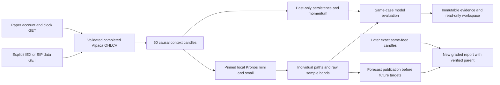

# TradeCopilot — Kronos forecasting research

A Python/PyTorch research platform for financial candle forecasts. TradeCopilot
connects to an Alpaca paper account, retrieves completed OHLCV bars, runs pinned
local pretrained Kronos models, compares identical cases against simple
controls, and records forecasts before later outcome grading.

The project emphasizes reproducible inference, causal input validation,
measurable model quality, immutable evidence and a read-only research dashboard.
It submits no broker orders. The completed experiments **have not established a
reliable forecasting or trading advantage**.

[](https://github.com/Vajraaaang/tradecopilot/actions/workflows/ci.yml)

## Latest recorded Kronos results

The October 6, 2026 development pilot used **100 planned and eligible historical
cases**, five stocks (AAPL, AMZN, MSFT, NVDA, TSLA), and four completed sessions
(October 1, 2, 5, 6). Each case used 60 consecutive regular-session minute bars
to predict 15 subsequent bars. Mini and small each retained 20 individual paths;
controls used the same cases. No Kronos fitting or threshold tuning occurred.

| Model / control | Direction accuracy, all eligible | Terminal MAE | Path MAE | Raw band coverage |
| --- | ---: | ---: | ---: | ---: |
| Kronos-mini | 53% | 14.77 bps | 10.90 bps | 50.73% |
| Kronos-small | 54% | 15.18 bps | 11.30 bps | 47.53% |
| Last-close persistence | 52% | **13.36 bps** | **10.14 bps** | N/A |
| Five-minute momentum | 35% | 28.49 bps | 16.80 bps | N/A |

**Persistence had lower price error than either Kronos model.** The one- or
two-case direction advantage on four sessions does not establish superiority.
Actual classes were 19 DOWN, 52 FLAT and 29 UP, using an inclusive ±10 bps FLAT
band. There were no inference errors in this run; failures remain in the
all-eligible accuracy denominator when present. MAE and raw coverage use scored
cases, with their counts reported.

The raw 10th–90th percentile bands are **uncalibrated**: their observed coverage
was about half the future prices, rather than their nominal 80% sample mass.
Mini retained 605/30,000 inconsistent OHLC rows and one negative-volume row;
small retained 1,186/30,000 inconsistent OHLC rows. Close forecasts were finite
and positive; inconsistent samples were counted without repair.


[Full experiment guide](docs/kronos-paper.md) ·
[Aggregate results](docs/results/2026-10-06-kronos-paper/pilot/summary.json) ·
[Independent audit](docs/results/2026-10-06-kronos-paper/pilot/independent-audit.json)

Independent reconstruction verified all 17 raw response pages, 7,800 retained
bars, 100 case identities, 400 model/control forecasts and 4,200 sampled neural
paths, including prospective paths. All 160,958 audit checks passed; four fresh
CPU calls reproduced saved paths bitwise. These checks establish reproducibility
of the recorded experiment, not predictive usefulness.

## Recorded prospective status

Five saved stock records, each containing mini and small forecasts, target
**October 7, 2026, 09:31–09:45 New York / 06:31–06:45 Pacific**. They were published
October 6 at 22:34:10 UTC before the first target. Their horizon includes the
overnight gap plus the first fifteen regular-session candles; it is not a
15-minute wall-clock forecast.

Their recorded outcomes are **pending**. Outcomes change only after an explicit
later fetch and exact-candle grade; passing the target time does not mark them
observed. The current evidence does not establish prospective accuracy.

## Research workspace

The compact dark layout uses [Robinhood Legend](https://robinhood.com/us/en/legend/)
as visual inspiration. It provides saved symbol/case/model selection, real
close/forecast/actual paths, a prospective queue, complete-cohort comparisons,
uncertainty and physical diagnostics, and source/model provenance. Displayed
prices carry their context timestamp. Account and clock fields are recorded
snapshots, not a live quote stream.


Raw licensed market rows, private full reports and paths, credentials, and
checkpoints remain local. Checked-in `summary.json` is an aggregate artifact;
it cannot be passed to the interactive report server as a private report.

## Try the viewer without credentials

```bash
uv sync --frozen
uv run tradecopilot forecast kronos demo --output-dir /ABS/private/kronos-demo
uv run tradecopilot forecast kronos serve /ABS/private/kronos-demo/report.json --open
```

This opens the same workspace with four fictional DEMOA/DEMOB cases,
deterministic toy paths and a persistence calculation. Every view is labeled
**offline synthetic / not evaluated**. It makes no broker requests, reads no
credentials and performs no pretrained-model inference. Numerical accuracy,
MAE and coverage are intentionally unset. The real-results exporter rejects
this fixture.

## Run the Kronos workflow

Requirements: Python 3.12+ and [uv](https://docs.astral.sh/uv/). Bundled browser
views require no Node/npm installation. Model inference is optional and local.

```bash
git clone https://github.com/Vajraaaang/tradecopilot.git /ABS/tradecopilot
cd /ABS/tradecopilot
uv sync --frozen --group dev --extra kronos --extra plots

# Existing keys are stored securely; credential input is hidden.
uv run tradecopilot auth alpaca

# Explicit public pinned download; inference itself never downloads weights.
uv run python /ABS/tradecopilot/scripts/setup_kronos.py \
  --output-dir /ABS/private/kronos-checkpoints

uv run tradecopilot forecast kronos fetch \
  --start 2026-10-01 --end 2026-10-07 \
  --symbols AAPL AMZN MSFT NVDA TSLA --feed sip \
  --output-dir /ABS/private/kronos-source

# Historical reproduction; these inspected dates are development evidence.
uv run tradecopilot forecast kronos pilot \
  --bars /ABS/private/kronos-source/bars \
  --checkpoints /ABS/private/kronos-checkpoints \
  --samples 20 --no-prospective --output-dir /ABS/private/kronos-pilot

uv run tradecopilot forecast kronos serve \
  /ABS/private/kronos-pilot/report.json --open
```

Replace `/ABS/...` with absolute paths. Fetch, pilot, grade and rendered-result
output directories must be new; reports are immutable. Checkpoint setup can
reuse a matching cache but cannot silently replace or expand its manifest.
`--end` is an **exclusive New York date**. The viewer defaults to
`http://127.0.0.1:8767/`.

The paper endpoint supplies account/clock reads; completed candles come from
Alpaca's separate data endpoint. IEX/SIP is explicit, with no silent fallback.
Completed historical SIP access was verified for the recorded account/run;
real-time consolidated SIP entitlement was not tested.

To record future prices, fetch fresh completed candles and clock, then omit
`--no-prospective`. To grade an original saved forecast after its targets and
feed data are actually available:

```bash
uv run tradecopilot forecast kronos grade /ABS/private/original/report.json \
  --bars /ABS/private/later-source/bars --output-dir /ABS/private/graded
```

Both forecast and outcome sources must use the same feed. Missing exact target
candles remain pending. Grading writes a new report and preserves the original
forecast, publication time and artifact lineage.

## Architecture and engineering



- **Data contracts:** UTC minute ends, XNYS sessions, exact contiguous inputs,
  source/receipt distinction, source hashes, exclusions and no imputation.
- **Model provenance:** pinned licensed upstream code, matching tokenizer/model
  revisions, verified local safetensors, CPU float32, fixed sampling and RNG
  restoration. Amount is explicitly a volume × mean-OHLC proxy, not observed
  dollar volume.
- **Evidence integrity:** immutable private inventories, checksums, source and
  dependency fingerprints, prospective publication deadlines, same-feed later
  outcomes, and recorded failures. Historical bar-end availability and unknown
  vendor pretraining overlap remain explicit assumptions.
- **Application boundary:** read-only report GET/health routes, repeat integrity
  validation, CSP nonces, text-safe rendering, native selectors and keyboard
  focus, responsive panels, accessible chart descriptions and visible raw-band
  boundaries. No full WCAG conformance is claimed.
- **Delivery:** frozen dependencies, optional model extras, wheel/sdist, Docker,
  GitHub Actions offline tests and a runtime container with external networking
  disabled. No cloud production deployment is claimed.

The recorded October 6 validation passed **1,035 local tests**, Ruff, strict
mypy, independent specification/code reviews, package checks, browser checks
and all four hosted push/PR checks. [Validation evidence](docs/results/2026-10-06-kronos-paper/pilot/validation.json)
is dated; current branch checks determine the status of subsequent changes.

Timing is also bounded by evidence: the recorded UTC registration-to-publication
interval was 1,149.28 seconds, versus 384.07 seconds of measured model loops and
calls. The 765.22-second discrepancy has an unverified cause. That run has no
end-to-end timer and supports no end-to-end speed claim.

## October 7 engineering hardening

The next revision strengthens failure handling and evidence boundaries rather
than claiming better model predictions:

- Grading checks every matched candle's feed and availability at the recorded
  receipt, exact fifteen-minute target grids, and publication before the first
  target. Derived reports require a verified original and preserve forecasts.
- Streamed Alpaca data has a cumulative 64 MiB limit. Initialization, historical
  and prospective model phases share measured admission/acceptance budgets;
  blocking native calls are not forcibly interrupted.
- Invalid model/source provenance and failed publication produce explicit,
  redacted terminal progress. New runs record phase timers and monotonic
  end-to-end duration through publication.
- Public exports validate and project nested fields, preventing unrecognized
  private fields and free-form messages from leaking into aggregate artifacts.
- Optional CI runs an actual native tokenizer/model/autoregressive CPU smoke
  using tiny untrained configurations, without downloads or market-performance
  claims.

The October 7 revision passed **1,104 local tests**, Ruff and strict mypy, with
independent specification/code reviews and browser checks for both views.
[Hardening validation](docs/results/2026-10-07-kronos-hardening/validation.json)
records these checks separately from the original market evaluation.
Four additional calls with the original cached pretrained checkpoints matched
the original outputs bitwise after the repairs. Original quality scores and
publication records were not rewritten.

## Earlier experiments

Previous results remain documented, including failures. RL policy returns and
forecast accuracy are separate outcomes; hosted Jev weights were never trained
by the local policy learner.

| Experiment | Recorded result | Details |
| --- | --- | --- |
| Direct TCN/LSTM versus CPU | LSTM 47.40% versus CPU 47.44% on 6,300 final cases; no supported gain | [Supervised forecasting](docs/supervised-forecasting.md) |
| Cached Jev correction | Context and context+Jev both 44% on 50 consumed cases | [Supervised/cached evaluation](docs/supervised-forecasting.md) |
| Jev-assisted RL | Jev direction 24% versus prior 36%; simulated policy −3.42 versus −3.49 bps/day, inconclusive and negative | [Jev/RL evaluation](docs/jev-rl-evaluation.md) |
| RL capacity comparison | Selected recurrent policy lost 1.14 bps/day on frozen test; not promoted | [Neural RL evaluation](docs/rl-neural-evaluation.md) |
| Selective OHLCV study | 46.51% versus 46.18%; the 80% selective gate failed | [Selective accuracy](docs/selective-accuracy.md) |
| OHLCV development | Richer features/boosting did not win the validation comparison | [OHLCV development](docs/ohlcv-development.md) |
| Original archived-minute study | Logistic 38.8% versus prior 40.7%; ten-case Jev 20%, all abstained | [Historical evaluation](docs/historical-evaluation.md) |

The deterministic Ross first-pullback terminal monitor, visual desk, and optional
Jev market opinions are also retained. See [strategy](docs/strategy.md),
[architecture](docs/architecture.md), [forecasting](docs/forecasting.md),
[configuration](examples/forecast-config.json), [provider safety](docs/safety.md),
[replay format](docs/replay-format.md), and [implementation history](docs/implementation-history.md).

For the original credential-free synthetic forecast workflow:

```bash
uv sync --frozen
uv run tradecopilot forecast demo --output-dir /ABS/private/classic-demo
uv run tradecopilot forecast serve /ABS/private/classic-demo/run/report.json --open
```

Synthetic demonstrations test the software workflow. They are not measured
market accuracy or actual provider/model execution.
