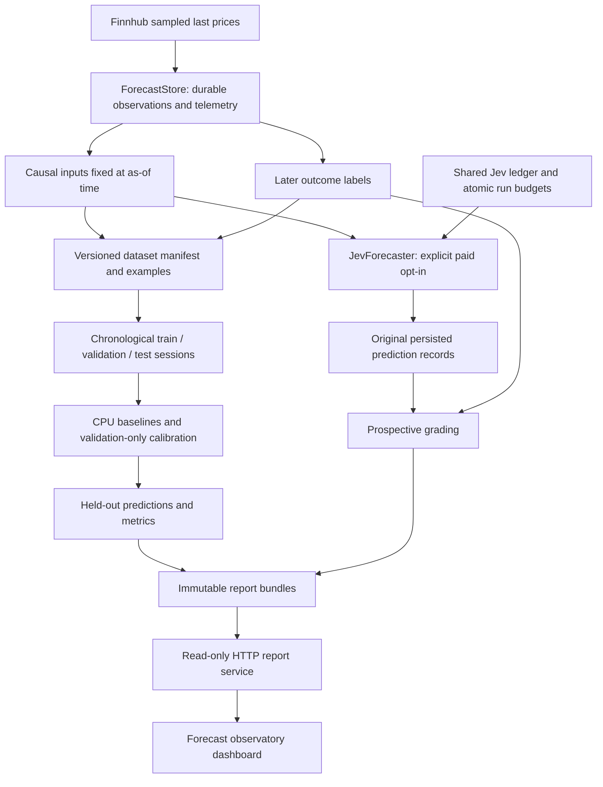

# Architecture

TradeCopilot contains a forecasting research workflow and the original
deterministic strategy desk. They have separate data, outcome and decision
contracts. The forecasting workflow has its own durable observation store and
saved-report server; the original desk keeps its operational journal and live
strategy state machine.

## Forecasting architecture



The feature path requires both event and receipt time to precede the input
anchor. Label/outcome fields never enter the Jev request. Prospective inference
checks accumulated source age and the target deadline after acquiring the
ledger writer lock, before reserving or dispatching a paid request. Responses
arriving at/after the target are retained as failed prospective inference with
their usage metadata.

### Forecast module ownership

All paths below are relative to `src/tradecopilot/`.

| Module | Responsibility |
| --- | --- |
| `forecast/contracts.py` | Frozen configuration, observation, example, dataset and prediction contracts; content identities and feature/label versions |
| `forecast/sessions.py` | XNYS regular-session bounds, including holidays, early closes and DST |
| `forecast/data.py` | SQLite WAL observations, prediction records, sanitized events and persistent atomic collection gate |
| `forecast/collector.py` | Bounded Finnhub collection, dispatch pacing, transient retry limits and telemetry |
| `forecast/features.py` | Receipt-aware causal feature construction and separately matured future outcome labels |
| `forecast/dataset.py` | Deterministic dataset construction, immutable exports and manifest/content verification |
| `forecast/demo.py` | Deterministic synthetic observation generation for the offline demo |
| `forecast/baselines.py` | Training-only CPU model fitting/scaling, validation temperature calibration, prediction and JSON model artifacts |
| `forecast/jev.py` | Pinned typed Jev forecast requests, probability validation, prospective timing, shared ledger/run caps and clearly labeled local fixtures |
| `forecast/evaluation.py` | Purged session splits, probability metrics, calibration/coverage diagnostics and session-level bootstrap intervals |
| `forecast/experiment.py` | Reproducible experiments, per-symbol results, prediction cases, source fingerprints and verified report bundles |
| `forecast/cli.py` | Explicit offline, collection, paid prediction, grading, status and serving commands |
| `forecast/service.py`, `forecast/dashboard.html` | Saved-report HTTP routes, repeated bundle verification and the static report interface |
| `providers/finnhub.py` | Price-only quote normalization and sanitized permanent/transient failure classification |
| `jev.py`, `market_opinion.py` | Existing strategy-review and independent market-opinion behavior used by the original desk |
| `auth.py` | OS-keychain/environment loading for Jev, Finnhub and the existing providers |

### Persistence and failure boundaries

The forecast database contains `forecast_observations`, `forecast_predictions`,
`forecast_events`, and `forecast_poll_gate`. It does not apply the original
journal's 10,000-row pruning policy. Exact observation identities deduplicate
repeated ingestion while retaining event/receipt provenance.

The Jev usage database is shared with the original adviser. Its
`jev_attempts` table records reservations and results; `forecast_run_limits`
persists the smaller request/spend limits for a forecast run. A timed-out or
unfinished attempt keeps a conservative maximum-token reservation. Reopening
an application or changing working directories cannot reset those limits.

Report bundles contain datasets, examples, predictions, split IDs, JSON model
parameters, configuration, dependency/source fingerprints and metrics. The
report server exposes only the dashboard, report JSON and health routes; it
never invokes a provider. Bundle integrity is checked before server startup and
on report/health reads. Invalid or unavailable bundles return sanitized failures.

Missing or late outcomes remain unscored. Errors and absent predictions remain
visible in coverage denominators. Synthetic, local fixture and live API execution
are labeled explicitly. See [forecasting.md](forecasting.md) for the complete
data/label contract and [validation-2026-10-01.md](validation-2026-10-01.md) for
the executed evidence.

## Deterministic strategy architecture

The original desk evaluates supported market/broker evidence as follows:

```text
Alpaca stream -> trades/quotes/minute bars -----+
Robinhood MCP -> positions/P&L/Level 2/scans ---+-> normalized MarketFrame
Shibui MCP -> float/ADV50/filing context --------+
Sourced catalyst feed or manual evidence --------+
Replay/mock providers ---------------------------+          |
                                                            v
 indicators -> impulse/pullback -> risk plan -> strategy engine -> typed state machine
                                                            |
                       +------------------+----------------+----------------+----------------+
                       v                  v                v                v                v
                 SQLite journal     Rich terminal    local web desk   alert sinks     safe explainer
                                                                                           |
                                                                    deterministic template or optional
                                                                    tool-free OpenAI structured output
```

## Strategy module ownership

- `providers/base.py` defines market, broker-read, supplemental, tape, and frame
  protocols.
- `providers/replay.py` replays timestamped JSONL, rejects look-ahead, dedupes
  bars and book snapshots, and emits the same normalized models as live code.
- `providers/mock.py` is network-free.
- `providers/alpaca.py` uses the official read-only market-data SDK and stream
  for trades, quotes, minute bars, and unclassified trade prints. It imports no
  trading client and contains no order method.
- `mcp_client.py` owns the official MCP SDK Streamable HTTP session.
- `auth.py` stores Robinhood OAuth and Alpaca market-data credentials only in
  the operating-system keychain. The browser receives an OAuth code on a
  one-use loopback callback, never an application data surface.
- `providers/robinhood.py` wraps only `ReadOnlyToolSurface`, serializes same-tool
  requests, normalizes exact quote/candle/book/position/risk schemas, paginates
  bounded account reads, uses exponential backoff with jitter, and opens a
  circuit breaker after repeated failures. It never receives the complete MCP
  client.
- `providers/polling.py` concurrently composes approved market, broker,
  supplemental, and tape reads into an always-on frame stream without
  overlapping one poll iteration. Failed quotes can only age into stale data;
  failed position reconciliation removes account risk and fails closed.
- `providers/shibui.py` exposes three reviewed read tools and fixed SQL for
  `ownership_stats.shares_float`, 50-day daily volume context, and recent SEC
  filing metadata. `providers/supplemental.py` retains a sourced file boundary.
- `providers/live.py` merges providers by normalized ticker. Alpaca is
  authoritative for intraday price/bars/tape, Robinhood for account/Level 2,
  and Shibui only for daily enrichment. Live symbol changes clear per-symbol
  polling caches before the next frame.
- `models.py` contains frozen, timezone-aware normalized models with provider
  time, receipt time, calculated age, source, and quality.
- `indicators.py`, `features.py`, `risk.py`, and `level2.py` own calculations.
- `strategy.py` owns pillars, entry, hold/exit, reentry, and day-stop decisions.
- `state_machine.py` rejects illegal transitions and records exact evidence.
- `monitor.py` runs every frame through the deterministic engine, deduplicates
  transitions, rate-limits explanation generation by event significance, and
  flushes the journal during graceful shutdown. Its observer receives only the
  normalized frame, deterministic decision, and validated explanation.
- `webapp.py` sanitizes observer output, computes display-only chart series
  without look-ahead, and serves loopback-only JSON/static and SSE surfaces.
- `chat.py` defines the optional tool-free OpenAI chat boundary. It receives a
  reduced decision context, requests structured output with configured reasoning,
  and rejects state, price, evidence, or execution-boundary conflicts.
- `web/` contains the Legend-inspired application shell, exact public-source
  SVG path assets, rotating canvas charts, position feedback, screener, and
  chat-like deterministic query interface.
- `journal.py` persists observations, transitions, manual position changes,
  session locks, versions, and experiments in SQLite WAL mode.
- `alerts.py` emits deduplicated, sanitized transition notifications to the
  dashboard/browser and an optional HTTPS webhook; it carries no broker data.
- `backtest.py` runs deterministic chronological replay evaluation and writes
  immutable nightly reports without promotion.
- `evaluator.py` computes chronological replay metrics and walk-forward windows.
- `research.py` enforces immutable parameters, one-variable proposals, evidence
  gates, and explicit human approval without rewriting production settings.

## Event and failure semantics

Priority is structural invalidation, stale data, trigger crossing, other exit
signals, indicator loss/reclaim, levels, state transition, candle close, then
position heartbeat. The engine evaluates every frame. Explanations run only on
transitions, relevant one-minute closes, position heartbeat, or explicit
refresh.

Missing critical data produces `DATA_INSUFFICIENT`. Quote or Level 2 older than
the configured threshold produces `DATA_STALE`. During exposure, stale data can
never become `HOLD`; the last structural stop is shown and manual/broker-side
risk controls govern.

The standalone live composition is implemented. It starts only after Alpaca
market-data keys and Robinhood MCP OAuth are available in the OS keychain.
Missing or failed auth produces no frame and therefore no signal. Replay and
mock paths require neither provider.

The browser surface has only snapshot, health, sanitized SSE, symbol-selection, and
explanation-query routes. Symbol selection can only ask a configured read-only
provider to load a symbol and fails closed in replay. It has no order, account,
watchlist, scanner, portfolio, or transfer mutation route. The screener is a
projection of normalized evaluated candidates, not a Robinhood watchlist or
scanner mutation.

## Journal schema

SQLite tables are `transitions`, `observations`, `position_events`, `session_locks`,
`strategy_versions`, and `experiments`. JSON payloads include compact bars,
quotes, spreads, indicators, pillars, supplemental evidence, risk snapshots, setup labels,
plans, position/outcome placeholders, sampled Level 2, reasons, rule results,
data quality, and optional explanation versions. Secret-like keys and account
identifiers are redacted before persistence. High-volume observations are
bounded by `raw_snapshot_retention_rows`; transitions and session locks are not
pruned.
