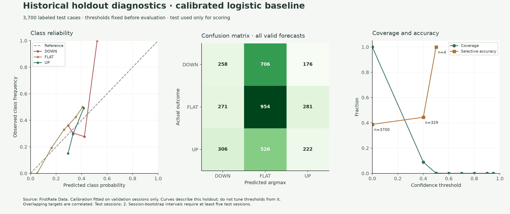
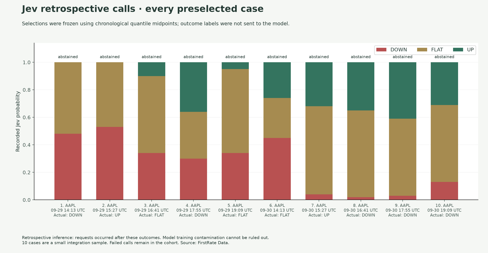

# Real historical stock evaluation — October 1, 2026

This evaluation uses archived stock prices rather than the synthetic demonstration.
Its results are weak: the learned CPU baseline did not beat the class prior's
argmax accuracy, Jev performed worse than the prior on its small selected cohort,
and every model abstained at the fixed confidence threshold. The figures and
derived results below record those outcomes without threshold tuning.

## Data and availability

The source is [FirstRate Data](https://firstratedata.com), using the public free
minute-bar sample links on its AAPL, MSFT, AMZN, NFLX and TSLA product pages.
The archives were downloaded on October 1, 2026 and cover September 16–30.
Source URLs, actual retrieval timestamps, archive/member SHA256 hashes and counts
are recorded in [the derived results](results/2026-10-01-historical/derived-results.json).

The import retained 19,500 regular-session minute-close observations. September
16 supplies prior-session closes; the modeled dataset spans the ten XNYS sessions
from September 17 through September 30. The importer excluded 23,068 extended/
non-session bars and 1,950 first-session bars with no available preceding close.

Provider timestamps identify the start of a minute. The closing price is made
available at start +1 minute in replay. The resulting receipt timestamp is an
explicit availability assumption, not an observed historical network receipt.
The previous-close feature uses the preceding XNYS session's last regular minute
close, which is a proxy rather than an official daily close. Missing bars are
never filled. The free sample does not identify its adjustment variant, so that
uncertainty is retained in source metadata. See the provider's
[format documentation](https://firstratedata.com/about/FAQ).

The provider [license](https://firstratedata.com/about/license) permits derivative
research and charts with attribution. Raw CSV, imported observations, price
tables and complete private report bundles are not published here. Public files
contain plots, aggregate metrics, model outputs summarized by cohort/symbol,
configuration and source metadata.

## Frozen protocol

- Universe: AAPL, MSFT, AMZN, NFLX, TSLA, selected from the available free samples.
- Target: 15-minute close-price return; DOWN below −10 bps, FLAT from −10 through
  +10 bps inclusive, UP above +10 bps.
- Features: existing seven causal price features, five-minute lookback, six
  observations minimum, 60-second maximum history gap, one-minute anchors.
- Split: whole sessions ordered chronologically; outcome-time purging; training
  scaling and fitting; validation-only temperature calibration; test used only
  for scoring.
- Abstention: fixed 0.6 probability threshold; Jev must also meet its reported
  confidence threshold. No threshold was changed after these results.
- Jev cohort: ten deterministic chronological quantile-midpoint test rows,
  frozen before requests. Because of the ordering/stride, all ten rows were
  AAPL. This is explicitly a one-symbol Jev sample, not a five-symbol Jev benchmark.
- Jev requests used `prospective=False` and excluded outcome fields. They were
  made after the historical outcomes, with a persistent ten-attempt/$0.05 run
  limit inside the existing global ledger and no automatic paid retries.

| Split | Sessions | Dates | Labeled examples |
| --- | --- | --- | ---: |
| Train | 6 | September 17–24 | 11,100 |
| Validation | 2 | September 25 and 28 | 3,700 |
| Test | 2 | September 29–30 | 3,700 |

The dataset has 18,500 labeled examples. Its content identity and the saved run
identities are in the derived JSON. The test class counts are DOWN 1,140,
FLAT 1,506 and UP 1,054. All four CPU variants use the same test cases.

## Full CPU holdout

Argmax accuracy scores every valid distribution, including distributions marked
abstained. Coverage counts only non-abstained forecasts. Log loss and Brier score
are lower-is-better probability scores; multiclass Brier here sums over classes.

| Model | Cases scored | Argmax accuracy | Macro F1 | Log loss | Brier | Coverage |
| --- | ---: | ---: | ---: | ---: | ---: | ---: |
| Training-class prior | 3,700 | 40.70% | 0.1929 | 1.08994 | 0.66052 | 0% |
| Momentum frequencies | 3,700 | 40.70% | 0.1929 | 1.09273 | 0.66239 | 0% |
| Logistic regression | 3,700 | 38.76% | 0.3448 | 1.08949 | 0.65982 | 0% |
| Logistic + validation calibration | 3,700 | 38.76% | 0.3448 | 1.08914 | 0.66021 | 0% |




The logistic model's macro F1 exceeds the prior's, while its overall accuracy is
lower. Probability-score differences are small. No variant produced a usable
forecast at the fixed 0.6 threshold. Adjacent targets overlap and only two test
sessions exist, so no session-bootstrap accuracy interval is reported. In the
diagnostic curve, a 100% selective-accuracy point represents only four cases; its
sample count is labeled and it does not justify selecting a threshold.

## Retrospective Jev sample

The same ten AAPL cases were scored by every model. All ten Jev calls returned
valid distributions; none were replaced or omitted. The sample's actual labels
were DOWN 5, FLAT 3 and UP 2.

| Model | Cases scored | Argmax accuracy | Macro F1 | Log loss | Brier | Coverage |
| --- | ---: | ---: | ---: | ---: | ---: | ---: |
| Training-class prior | 10 | 30% | 0.1538 | 1.14867 | 0.70001 | 0% |
| Momentum frequencies | 10 | 30% | 0.1538 | 1.18449 | 0.72613 | 0% |
| Logistic regression | 10 | 10% | 0.0606 | 1.19856 | 0.73300 | 0% |
| Logistic + validation calibration | 10 | 10% | 0.0606 | 1.16239 | 0.70915 | 0% |
| Jev retrospective inference | 10 | 20% | 0.1333 | 4.93869 | 0.90840 | 0% |




Jev used 7,259 input tokens, with estimated cost **$0.000304878** at the configured
provider rate. All ten forecasts abstained and there were zero inference errors.
The shared ledger was preserved; these were ten additional attempts, bringing
the existing total to fifteen at execution time.

This sample does not show Jev outperforming the class prior. It is too small and
too narrowly selected to rank models reliably. Requests occurred after outcomes,
and historical dates/patterns may overlap with model training data, so this is
not prospective validation. The probabilities are not calibrated on independent
market data and no trading returns or transaction costs were evaluated.

## Reproduce

The free samples can change. A new download must produce a new dataset identity
and results; the published hashes identify the files used in this run. Keep raw
archives and private report bundles locally for audit.

```bash
uv sync --frozen --all-extras

# Download free source archives and run CPU baselines; no paid inference.
uv run --no-sync python scripts/run_historical_evaluation.py \
  --download --archives .tradecopilot/history/source-01 \
  --output-dir .tradecopilot/history/run-01

# Optional: a fresh run with at most ten paid retrospective Jev calls.
# Requires the stored Jev key; existing ledger/run limits still apply.
uv run --no-sync python scripts/run_historical_evaluation.py \
  --archives .tradecopilot/history/source-01 \
  --output-dir .tradecopilot/history/run-02 --jev --run-id historical-study-02

# Render plots and derived JSON from the verified local reports.
uv run --no-sync python scripts/render_historical_results.py \
  .tradecopilot/history/run-02/baseline/report.json \
  --retrospective .tradecopilot/history/run-02/retrospective/report/report.json \
  --output-dir .tradecopilot/history/figures-02
```

Importer, temporal guards, source binding, selection, failure accounting and
historical/prospective separation have automated regression coverage. The full
local suite passed 455 tests, Ruff passed, and strict mypy passed on 57 source
files. GitHub Actions repeats the offline suite and container checks without
provider secrets or paid model calls.
