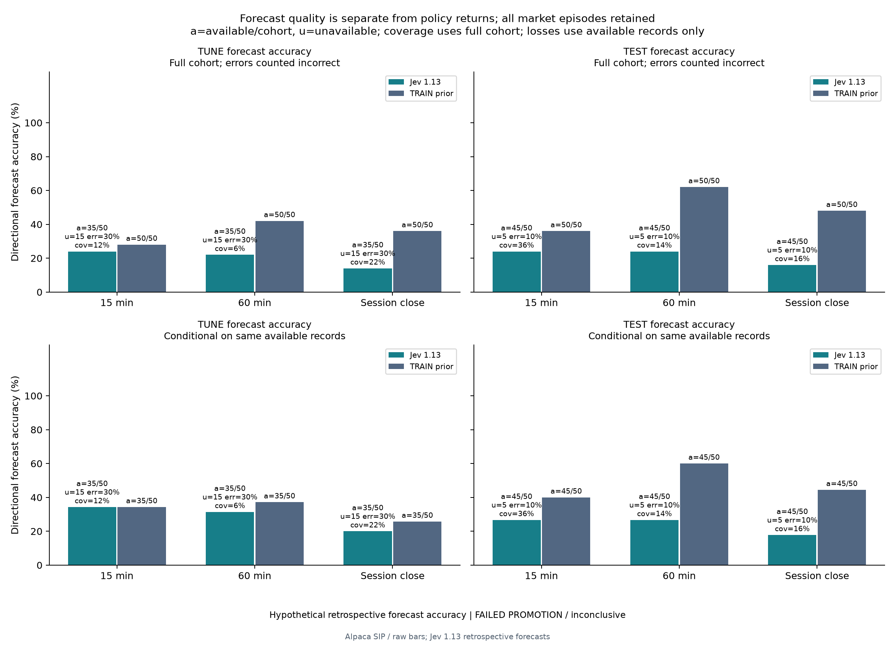
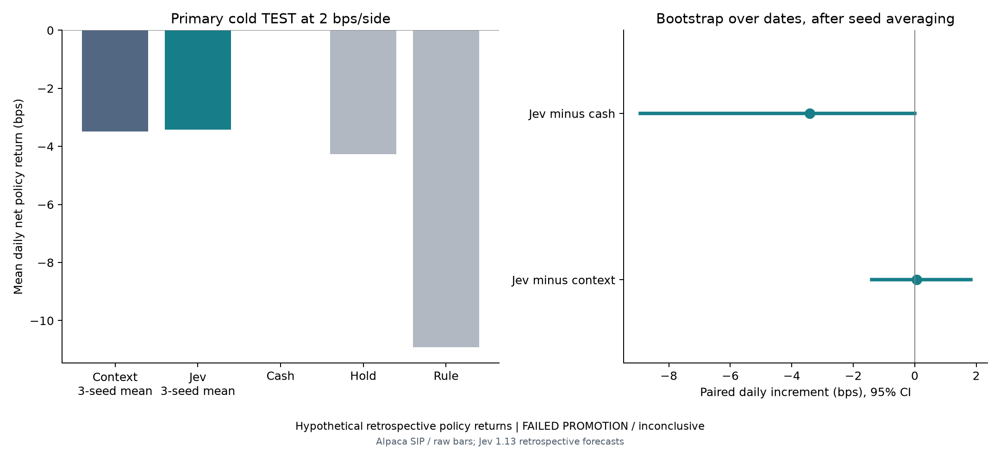
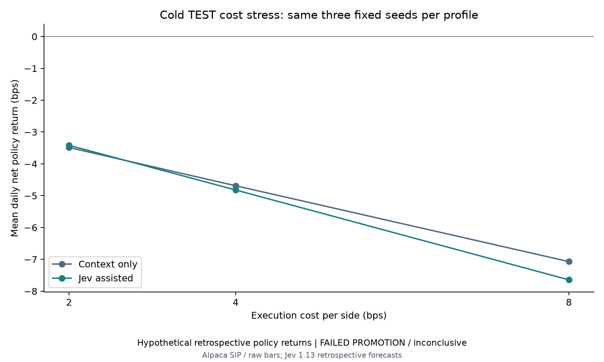
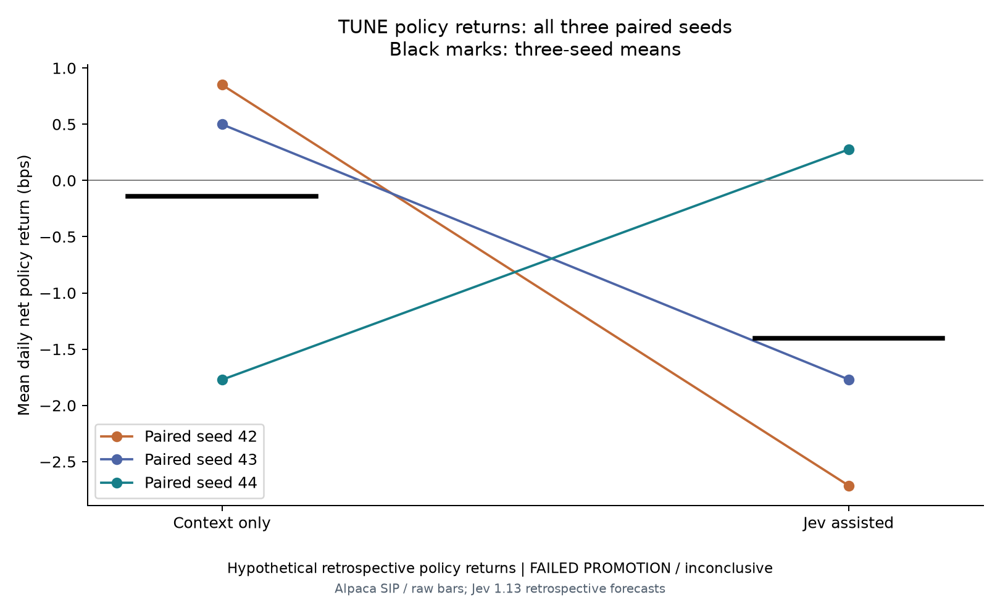

# Jev-assisted recurrent policy evaluation

**Status: paid acquisition and all six matched evaluations complete; high accuracy was not achieved and no policy was promoted.** The user approved API spending on October 4, 2026. Acquisition used 80 unique requests and 587,708 reported input tokens, for an estimated $0.024683736 at the published rate. Sixty-eight batches validated; twelve failed validation and remain explicitly unavailable. The locked test results are below. Settings were not changed after scoring.

## Measured results

Each test horizon has 50 registered cases on ten dates, including five unavailable forecasts. The primary 15-minute direction task scored **24% across the full cohort** (12 correct of 50) and **26.67% on validated responses** (12 of 45). The TRAIN-fitted class prior scored 36% across all 50 cases and 40% on those same 45 available cases. Removing unavailable responses does not make Jev competitive with this reference.

| TEST horizon | Jev full cohort, errors incorrect | Jev on available cases | Prior full cohort | Prior on same available cases |
| --- | ---: | ---: | ---: | ---: |
| 15 minutes | 24.00% (12/50) | 26.67% (12/45) | 36.00% (18/50) | 40.00% (18/45) |
| 60 minutes | 24.00% (12/50) | 26.67% (12/45) | 62.00% (31/50) | 60.00% (27/45) |
| Session close | 16.00% (8/50) | 17.78% (8/45) | 48.00% (24/50) | 44.44% (20/45) |

Proper probability scores were worse too. On the available 15-minute cases, Jev log loss was 1.46541 and Brier 0.89781, versus 1.10129 and 0.66729 for the matched prior. At the unchanged 0.6 selection rule, Jev selected 18/50 cases (36% coverage) and was correct on 5/18 (27.78%). The corresponding 60-minute figures were 7/50 selected and 3/7 correct; at session close, 8/50 were selected and none was correct. No threshold was changed to improve the headline.

The policies produced negative net returns after base execution costs. The primary comparison uses every registered seed, rather than choosing whichever checkpoint looked best on TEST.

| TEST policy | Mean daily net return (bps) |
| --- | ---: |
| CONTEXT_ONLY, three-seed mean | -3.487 |
| JEV_ASSISTED, three-seed mean | -3.418 |
| Cash | 0.000 |
| Capped intraday hold | -4.261 |
| Fixed momentum rule | -10.915 |

The Jev-minus-neutral increment was just **+0.069 bps/day**, with a paired 95% date-bootstrap interval of **[-1.394, +1.828] bps/day**. This does not establish an improvement. The Jev-minus-cash interval was [-8.934, +0.001] bps/day. Drawdown met the registered screen; positive net return, positive comparison lower bounds and doubled-cost improvement did not. The report records `inconclusive_not_promoted`.

| Execution cost per side | CONTEXT_ONLY mean (bps/day) | JEV_ASSISTED mean (bps/day) |
| --- | ---: | ---: |
| 2 bps | -3.487 | -3.418 |
| 4 bps | -4.688 | -4.821 |
| 8 bps | -7.071 | -7.644 |

At doubled and quadrupled costs, Jev was worse than the neutral control. All checkpoints remained fixed.

All six learners completed exactly 92,160 steps and 7,200 optimizer epochs, totaling 552,960 steps. Measured learning times ranged from 421.16 to 443.49 seconds. On TUNE, CONTEXT_ONLY seed42 and JEV_ASSISTED seed44 were selected; the common TEST primary still averages all three seeds. The TUNE means were -0.141 and -1.402 bps/day, respectively. Some individual tuning seeds were positive, but those favorable observations do not replace the negative held-out evidence.

Source: Alpaca SIP/raw bars and pinned Jev 1.13 retrospective API forecasts. Public [aggregate results](results/2026-10-04-jev-rl-ablation/summary.json), [registration](experiments/jev-rl-2026-10-04/registration.json), [acquisition amendment](experiments/jev-rl-2026-10-04/acquisition-amendment.json) and [training budget](experiments/jev-rl-2026-10-04/budget.json) preserve the fixed protocol. Private report ID: `4daecec03de0d7deaa9f37516165ea06137233d5c743e83771a33a985642d4a2`.

These results do not support 80% forecast accuracy, profitable simulated deployment or improved Jev predictions. The experiment preserves an unfavorable result rather than changing dates, targets, thresholds, seeds or denominators after inspection. A later revised design requires new confirmation data; this test period is now consumed.

## Independent bias and uncertainty diagnostics

The reviewer independently reconstructed all 36 scored files, 1,800 valid/resolved episodes and 295,200 accounting transitions. Every file has the same 50 episodes, ten dates and five symbols per date. Direct date means, aggregate costs/trades/drawdowns, checkpoint identities, TUNE choices, primary comparisons, stresses, TRAIN priors and forecast denominators matched. No scoring cases were omitted. Four fresh deterministic checkpoint replays, rebuilt from the sealed cache for both selected profiles, matched complete saved episodes and all 656 ledger transitions exactly.

| TEST horizon | Full-cohort accuracy | Descriptive 95% date-bootstrap interval | Failure-adjusted macro-F1 |
| --- | ---: | ---: | ---: |
| 15 minutes | 24% | 12–36% | 0.230 |
| 60 minutes | 24% | 12–38% | 0.193 |
| Session close | 16% | 6–26% | 0.131 |

Full-cohort Jev-minus-prior accuracy intervals were [-26, +4], [-54, -26] and [-60, -10] percentage points, respectively. These estimates resample whole dates rather than treating correlated stock cases as independent observations. They are descriptive diagnostics added after release; they do not change the frozen winner or acceptance criteria.

The class breakdown exposes a model skew rather than hiding it: at session close, 37 of 45 available predictions were FLAT and none was UP, whereas the full truth contained 24 DOWN, eight FLAT and 18 UP cases. The complete confusion matrices, precision/recall/support, macro-F1 and bootstrap results are preserved in the public [independent audit](results/2026-10-04-jev-rl-ablation/independent-audit.json).

## Frozen comparison

The preceding MARKET_ONLY study selected one-layer 256-unit RecurrentPPO but did not earn promotion. This follow-up fixes that architecture and compares two policies across seeds 42, 43 and 44:

| Profile | Forecast inputs |
| --- | --- |
| CONTEXT_ONLY | Same market, ledger and forecast timing/reference metadata; valid forecast probabilities are uniform and confidence is zero |
| JEV_ASSISTED | Identical dimensions and metadata, with validated raw Jev probabilities and confidence |

Both have 151 observation dimensions and 1,035,524 parameters. Every seed receives 92,160 CPU training steps and the same optimizer settings. The TRAIN-only throughput probes measured about 200 and 203 steps/second; their weights were discarded. Learning is bounded at 600 seconds per seed, and an overrun blocks tuning even if all steps completed.

The primary TEST comparison averages all three seeds. The best TUNE checkpoint within each profile is a separately labeled diagnostic. Both checkpoint choices freeze before TEST access. Hosted Jev weights are not trained; the local policy learns simulated exposure decisions. The application creates no broker orders or production recommendation changes.

## Data and source audit

The source contains 81 Alpaca SIP/raw sessions from June 30 through October 22, 2025. June 30 supplies reference warmup. All symbols on a date belong to the same chronological block:

| Role | Dates | Sessions | Symbol episodes |
| --- | --- | ---: | ---: |
| TRAIN | July 1–September 24 | 60 | 300 |
| TUNE | September 25–October 8 | 10 | 50 |
| TEST | October 9–22 | 10 | 50 |

The five stocks are AAPL, AMZN, MSFT, NVDA and TSLA. A timestamp-only preflight found missing required minute bars for NFLX in 61 sessions. Its initial source and registration are preserved privately. NFLX was replaced with NVDA before any paid forecasts or quality scoring; both arms use the revised universe. These results cannot be directly compared with the previous March cohort.

Independent audit verified all 33 raw pages, byte hashes and pagination links, and every retained record: 320,008 downloaded rows, 162,958 regular-session exclusions and 157,050 retained bars. All 81 dates have complete minute grids. All 400 masked stock contexts, 1,200 forecast mappings and 400 prepared episodes matched source. The reviewer rebuilt every one of the 98,400 eligible TRAIN rows and obtained exact equality for normalized features, missing masks, fitted means/scales and fit identities. No outcomes were graded during these checks.

## Paid forecasts and timing

One request per session contains five stocks at the same as-of, 61 minutes after opening. Fifteen typed Choice questions cover 15 minutes, 60 minutes and session close. The target is the minute-bar close proxy at the target minute-end relative to the as-of completed close. DOWN means below −10 bps; FLAT includes both ±10-bps boundaries; UP means above +10 bps.

Arithmetic, ratios and target minutes are computed locally. Compact normalized recent bars and summaries mask actual tickers, calendar dates and absolute prices. Each question names its literal stock path. All 80 payloads were frozen before acquisition and remain unchanged.

Limits remain 100 global attempts, a 30-second cooldown, and ten attempts/$0.05 per group. The experiment also enforces 80 attempts/$0.25 conservative estimated cost atomically. Requests cannot repeat. Unknown usage reserves 64,000 input tokens; valid reported usage is settled even when answers fail validation. [Published pricing](https://typesafe.ai/blog/introducing-system-one-models-and-jev) is $0.042 per million input tokens, with free output tokens.

Actual generation and completion times remain UTC today. Historical replay availability is separately hypothesized at as-of plus 60 seconds; historical real-time delivery is not claimed. Forecast fields are masked before arrival and after target expiry. Valid low-confidence distributions remain available as features; availability is independent of confidence. Provider confidence is not measured market accuracy.

## Explicit acquisition amendment

The original collector stopped after six requests when one response failed validation. The estimated charge then was $0.001850898. All attempted requests and their evidence were preserved.

Before any neural training or forecast-quality grading, an explicit amendment authorized only the remaining never-requested batches. Successful and failed requests were never retried, and payloads and caps stayed fixed. Later failed responses were also preserved as unavailable. Each failed batch produces fifteen zero sentinels, which are explicitly not probability distributions. Every forecast field is masked in both policies, and all 400 market episodes remain included.

The original registration's abort policy remains archived unchanged. The cache binds the amendment, its abort-policy override, permanent reservations, exclusive collector lease and exact saved-response reconciliation against the durable ledger. This availability adaptation follows no observed accuracy, trading return or model-selection result.

An independent acquisition audit verified exactly 80 attempts, IDs 16–95, in eight groups of ten. The global ledger advanced from 15 to 95. Every request matched its original frozen payload; per-group and experiment costs remained below their caps. The minimum reservation gap was 30.0017 seconds. The cache has 1,200 forecast slots: 1,020 validated and 180 unavailable. Failed batch 5 retained original attempt 21 and was never retried.

## Evaluation and bias controls

All six runs must complete identical steps/updates, capacity, source/version/data/cache identities and valid elapsed evidence before tuning. Both profile checkpoint selections must be sealed before TEST. TEST uses date-level means over all three seeds, paired date bootstrap comparisons against the neutral policy and cash, common cash/hold/momentum controls, drawdown limits, and doubled/quadrupled execution-cost stress. No settings, seeds, dates or thresholds are selected from TEST performance.

Separate horizon-specific forecast scorecards report argmax accuracy, log loss, Brier score and selected accuracy/coverage at `min(max_probability, model_confidence) >= 0.6`. Class priors fit all TRAIN labels only and never enter policy training. Failures appear in full-cohort availability and error denominators; conditional available-case scores and accuracy counting unavailable forecasts as incorrect are separately labeled. Matched available-case priors and full-cohort priors remain distinct. Per-class confusion and descriptive date-based confidence intervals will supplement the fixed primary metrics, without changing acceptance criteria.

The vendor pretraining cutoff is unknown. Masking reduces recognizable-history exposure but cannot prove Jev has never seen related outcomes. Ten TEST dates, revised historical bars, assumed receipt times, synthetic delayed fills/capacity/costs, a fixed surviving-stock universe and independent daily capital resets limit generalization. The experiment is hypothetical retrospective evidence, rather than prospective accuracy or operational profit.

Raw bars, normalized vectors, individual forecasts, ledgers and checkpoints remain private. Published results will be aggregate only. Weak results will be retained; no high-accuracy or production-promotion claim is made without measured support.

## Verification and reproduction boundary

The implementation passed 732 full-suite tests after failure preservation, with the expanded 22 renderer fixtures verified separately. Ruff and strict mypy passed across 76 source files. Hosted validation, including the default network-disabled Docker runtime and optional synthetic RL job, is tracked in [PR #6](https://github.com/Vajraaaang/tradecopilot/pull/6). The final independent checks cover every source row, request, accounting transition, grade denominator and fixed comparison.

Install the optional stack with `uv sync --frozen --group dev --extra rl --extra plots`. The absolute-path CLIs are `scripts/download_alpaca_history.py`, `scripts/prepare_rl_data.py`, `scripts/collect_jev_rl_cache.py prepare`, `scripts/collect_jev_rl_cache.py collect`, explicit `continue` with a sealed acquisition amendment, and `scripts/run_jev_rl_ablation.py`. The renderer accepts a sealed report and its matching cache. Credentials come from existing local Keychain entries. The published registration and budget describe this exact measured run and its ledger baseline; a new acquisition requires a separately registered identity and verified budget rather than editing consumed artifacts.

These dates are now inspected. Replaying them is reproduction/development; a revised model requires new confirmation dates. Unknown vendor training overlap also requires genuinely prospective evidence for a future-accuracy claim. No further API spending, deployment, broker action or default-model change occurred after acquisition.
