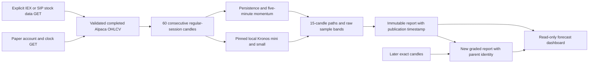
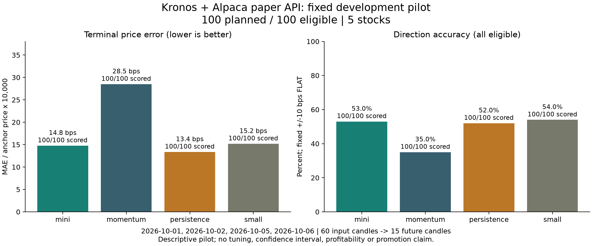
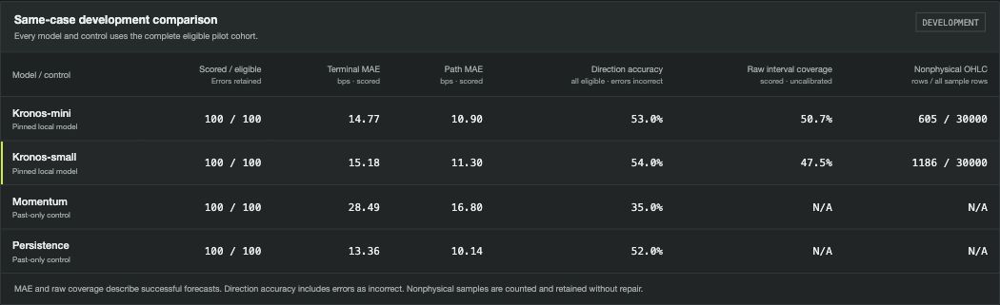

# Kronos forecasting with Alpaca paper-account data

TradeCopilot returns to its original candle-forecasting idea: retrieve completed
Alpaca candles, validate causal windows, run pinned local pretrained Kronos
models, compare identical cases against simple controls, and inspect forecast
paths alongside subsequently observed prices.

This milestone uses the Alpaca **paper** account for authentication and a safe
account/market-clock check. Market data comes from Alpaca's separate data host.
The client has GET-only operations; it has no order-placement operation. This
is a forecasting research integration, not a paper execution strategy.

## Implemented path



- `forecast/paper.py`: Keychain credentials, fixed paper/data hosts, explicit
  feed selection, pagination/response/time limits, completed XNYS minutes,
  redacted failures, no automatic retries or fallback feed.
- `forecast/kronos.py`: optional lazy dependencies, pinned local safetensors,
  source/checkpoint hash validation, CPU float32 inference, matching tokenizers,
  restored CPU RNG, and individual paths rather than a hidden averaged path.
- `forecast/kronos_study.py`: input-only case identities, exact context/horizon,
  fixed past-only controls and complete-cohort descriptive metrics.
- `forecast/kronos_run.py`: fixed protocol recorded before inference; all errors,
  path diagnostics, source identities and raw paths retained privately. A failed
  control or stale prospective context preserves completed historical results.
- `forecast/kronos_report.py`: private immutable inventory, content seal,
  publication deadline checks and separately received exact-candle joins.
- `forecast/kronos_dashboard.html`: completed versus prospective records, model
  selectors, context/forecast/actual curves, raw sample bands and full-cohort
  direction accuracy. Display never loads weights or calls a provider.

## Executed October 6 results

The paper account returned **ACTIVE**, and both IEX and explicitly requested SIP
reads succeeded. The fixed SIP import received 16,033 rows across 17 pages,
retaining 7,800 regular-session bars. It accounted for 8,228 outside-session rows
and five outside-range rows. All 100 planned anchors were eligible; every model
and control scored all 100 with zero inference errors.

| Model / control | Direction accuracy, all 100 | Terminal MAE, bps | Path MAE, bps | Raw band coverage |
| --- | ---: | ---: | ---: | ---: |
| Kronos-mini | 53% | 14.77 | 10.90 | 50.73% |
| Kronos-small | 54% | 15.18 | 11.30 | 47.53% |
| Persistence | 52% | **13.36** | **10.14** | N/A |
| Five-minute momentum | 35% | 28.49 | 16.80 | N/A |

**Persistence had lower price error than either Kronos model.** A one- or two-case
direction advantage on four sessions does not establish superiority. Actual
terminal classes were 19 DOWN, 52 FLAT and 29 UP; mini predicted FLAT in 92 cases
and small in 83. No model is promoted, and no 80% or profitability claim is made.
Mini retained 605/30,000 nonphysical OHLC rows and one negative-volume row;
small retained 1,186/30,000 nonphysical OHLC rows. Their raw 80%-mass bands covered
only about half the subsequently observed prices and are not calibrated.



[Aggregate JSON](results/2026-10-06-kronos-paper/pilot/summary.json) preserves
all four arms, confusion matrices, physical diagnostics, model/source pins and
protocol. Licensed minute rows, full paths and checkpoint files remain private.

Five stocks each have saved mini/small forecasts for **October 7, 2026, 09:31–09:45
New York time** (06:31–06:45 Pacific). They were published October 6 at
22:34:10 UTC, before the first target. Their horizon includes the overnight gap;
all five outcome records are **pending**. A later explicit fetch and grade is
required; clock passage does not mark them observed.

The independent audit reconstructed every raw page and bar, all case identities,
400 model/control forecasts and 4,200 sampled neural paths (63,000 rows,
including prospective paths). Its 160,958 checks passed; metric recomputation
agreed within 7.11×10⁻¹⁵. Four fresh CPU calls reproduced the first and last fixed
cases for both models **bitwise**, with no attempted network access. See the
[aggregate audit proof](results/2026-10-06-kronos-paper/pilot/independent-audit.json).

Local validation passed 1,035 regression tests, Ruff and strict mypy; wheel and
sdist built with vendor source, MIT license, pin manifest and dashboard assets
verified. Specification and code-quality reviews passed after repair loops.
The report was inspected in the browser with working model, case and evidence
selectors and no observed console errors. The compact dark workspace follows the user's
[Robinhood Legend reference](https://robinhood.com/us/en/legend/), with a saved-symbol
watchlist, dominant close-path chart, prospective queue, comparison and evidence
inspector. Keyboard Enter preserved focus across watchlist/queue redraws; wide,
default and 375px layouts were checked without page overflow. Raw-band edges
and control/empty chart descriptions were independently reviewed and repaired.
No full WCAG conformance is claimed. Final UI specification and code-quality
reviews passed; local check details are recorded in the
[validation artifact](results/2026-10-06-kronos-paper/pilot/validation.json).



Timing remains a limitation: recorded UTC registration-to-publication differs by
1,149.28 seconds, while the historical model-loop and prospective-call timers
sum to 384.07 seconds. The remaining 765.22 seconds have an unverified cause;
no end-to-end monotonic timer was recorded. The registered 900-second check
applies to starting new calls in each historical model loop, excluding setup
and prospective calls. Per-model loop timings and the separate throughput
probe do not establish end-to-end speed.

## Fixed development experiment

The configuration was fixed before full model-quality scoring:

| Setting | Value |
| --- | --- |
| Universe | AAPL, AMZN, MSFT, NVDA, TSLA |
| Sessions | October 1, 2, 5, 6, 2026 |
| Data | Explicit SIP, raw adjustment; regular-session minute bars |
| Anchors | Session open +61, +121, +181, +241, +301 minutes |
| Context and target | 60 contiguous completed candles; next 15 candles |
| Local candidates | Pretrained Kronos-mini and Kronos-small; no fitting |
| Sampling | 20 individual paths, seed 42 + fixed case index, temperature 1.0, top-p 0.9 |
| Compute | CPU float32, one Torch thread; stop starting new historical calls after 900 seconds per model loop |
| Controls | Last-close persistence; slope of the previous five minutes extrapolated forward |
| Direction | Terminal mean close relative to anchor; inclusive ±10 bps FLAT |
| Error policy | Every eligible case retained; errors count as incorrect in full-cohort accuracy |

This is a four-session **retrospective development pilot**, not a chronological
held-out training study or fresh confirmation. Price errors and success-only
accuracy use explicitly reported scored counts. The primary direction display
uses all eligible cases. Confusion matrices expose class behavior; a high
percentage driven by FLAT alone would not establish useful UP/DOWN prediction.

## Pinned models and input semantics

Upstream [Kronos](https://github.com/shiyu-coder/Kronos) is pinned at
`67b630e67f6a18c9e9be918d9b4337c960db1e9a`. Its MIT license and exact import-only
packaging patches are retained under `src/tradecopilot/_vendor/kronos/`.

| Model | Model revision | Tokenizer revision | Model parameters |
| --- | --- | --- | ---: |
| mini | `f4e68697d9d5aed55cef5c96aabc3376bcad9f81` | 2k: `26966d0035065a0cae0ebad7af8ece35bc1fb51c` | 4,108,032 |
| small | `901c26c1332695a2a8f243eb2f37243a37bea320` | base: `0e0117387f39004a9016484a186a908917e22426` | 24,741,376 |

Artifacts use UTC **completed bar ends**; model temporal features use naive
New York wall time. Inputs are open/high/low/close/volume plus
`amount = volume × mean(open, high, low, close)`, explicitly a derived proxy,
not observed dollar volume. Historical input availability is assumed at bar
end; the actual HTTP receipt is saved separately. Kronos pretraining overlap
with these market dates is unknown.

Each path is a separately sampled duplicated-input batch series with native
`sample_count=1`. The viewer shows the path mean and raw 10th–90th percentiles.
These are **uncalibrated sample bands**, not an 80% accuracy claim or validated
confidence interval. Nonphysical OHLC rows and negative volume/amount are
counted and retained without clipping. Nonfinite outputs or nonpositive closes
fail the prediction and remain in its denominator.

## Prospective publication and later grading

When the market is closed, the named horizon is **the overnight gap plus the
first 15 regular-session candles**. It is not a 15-minute wall-clock forecast.
The report records original inference and publication timestamps and checks
the publication deadline before and after its atomic publication. A deadline
crossing retracts the bundle. Loading and outcome grading verify the original
publication time. A derived graded report preserves it and records a separate
bundle-creation time and parent identity.

`grade` accepts the original feed and exact future minute timestamps only after
the final target has completed. Missing candles remain pending. Original
forecasts and their raw paths are never overwritten. Incomplete regrading
clears prior actuals in the new report to avoid attributing old prices to a new
source; its parent report remains unchanged.

## Reproduce locally

Use the existing secure credential command if credentials are not already in
Keychain. Secret input is hidden; keys do not belong in config files or Git.

```bash
uv sync --frozen --group dev --extra kronos --extra plots
uv run tradecopilot auth alpaca

# Explicit anonymous public checkpoint download; inference itself is local-only.
uv run python scripts/setup_kronos.py --output-dir /ABS/private/kronos-checkpoints

uv run tradecopilot forecast kronos fetch \
  --start 2026-10-01 --end 2026-10-07 \
  --symbols AAPL AMZN MSFT NVDA TSLA --feed sip \
  --output-dir /ABS/private/kronos-source

# Historical reproduction after these targets have passed:
uv run tradecopilot forecast kronos pilot \
  --bars /ABS/private/kronos-source/bars \
  --checkpoints /ABS/private/kronos-checkpoints \
  --samples 20 --no-prospective --output-dir /ABS/private/kronos-pilot

uv run tradecopilot forecast kronos serve /ABS/private/kronos-pilot/report.json --open
uv run python scripts/render_kronos_results.py \
  --report /ABS/private/kronos-pilot/report.json \
  --output-dir /ABS/public/kronos-aggregate-results
```

To record a genuinely future target, fetch fresh source data/clock and omit
`--no-prospective`. The selected next opening must still be in the future; the
client does not backdate a new forecast. For a recorded next-session forecast,
fetch a new outcome source after its exact final target, then:

```bash
uv run tradecopilot forecast kronos grade /ABS/private/original/report.json \
  --bars /ABS/private/later-source/bars --output-dir /ABS/private/graded
```

Completed historical SIP access was verified for this account/run; real-time
consolidated SIP entitlement was not tested. Access and delivery can vary by
entitlement; there is no silent switch to IEX. Missing target candles remain
pending until they are actually available. Raw provider responses, minute prices,
checkpoints and full forecast paths stay local. Published figures and JSON
contain derived aggregate results only.

The previous Jev, supervised neural and RL results remain in the repository,
including their negative findings. This milestone makes zero Jev calls and
introduces no fine-tuning, RL training, broker orders or profitability claim.
