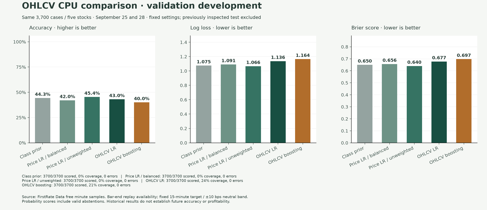

# OHLCV and CPU baseline development — October 2, 2026

This is the first data/representation milestone from the Jev improvement research.
It preserves more source information and adds a nonlinear comparator. It does
not establish improved Jev accuracy or promote a new production model.

## Changes

- Separate `historical-ohlcv-bars-v2` store retains exact Decimal open, high, low,
  close and volume, including the primer session. Source hashes, retrieval time,
  adjustment uncertainty and assumed bar-end availability remain explicit.
- `causal-ohlcv-v2` has 55 causal features: 1/2/3/5/10/15/30/60-minute returns,
  true high-low ranges, volume sums, return volatility, missing-window flags,
  candle body/location, true range, prior-only volume references, session time,
  prior-session price references and a bar-based VWAP proxy. Five fixed symbol
  indicator columns are added by the estimator.
- Missing history remains missing. Logistic regression fits its imputation and
  scaling on training only; histogram boosting handles missing values directly.
- Models export to non-executable JSON. Portable inference matches scikit-learn,
  including missing-only tree splits, and rejects malformed/cyclic nodes.
- Original price-only datasets, models, labels, reports and defaults remain
  compatible. The existing logistic default stays class-balanced; an explicit
  `class_weight=None` ablation is available.

The feature audit confirms that the original historical `source_age_seconds`
and `history_points` are constant: 0 and 6 respectively. The source had only
five varying v1 scalars. This diagnosis is measured, not an assumed cause of poor
forecasting. New feature statistics are in the derived result file.

## Frozen development protocol

Same original five-stock data, 15-minute/±10 bps labels and 0.6 confidence gate.
There are 21,450 regular-session bars including the primer. All five arms fit
the original 11,100 training cases from September 17–24 and score the identical
3,700 validation cases from September 25 and 28. The previously inspected
September 29–30 test cases are excluded from new feature construction and scoring.

Logistic settings remain C=1, `lbfgs`, 1,000 iterations and seed 42. The unweighted
v1 comparison changes only class weighting. Histogram boosting is fixed at 100
iterations, learning rate 0.05, depth 3, at most 15 leaves, minimum 100 rows/leaf,
L2=10 and no class weights. Random internal early-stopping splits are disabled.
No settings were retuned after these scores and no calibration/threshold search
was performed.

| Model | Validation accuracy | Macro F1 | Log loss | Brier | Coverage at 0.6 |
| --- | ---: | ---: | ---: | ---: | ---: |
| Class prior | 44.27% | 0.2046 | 1.07481 | 0.64988 | 0% |
| Price-only logistic, balanced | 42.03% | 0.3731 | 1.09094 | 0.65625 | 0.05% |
| Price-only logistic, unweighted | 45.35% | 0.3137 | 1.06605 | 0.63986 | 0% |
| OHLCV logistic, unweighted | 43.03% | 0.3724 | 1.13636 | 0.67723 | 24.32% |
| OHLCV histogram boosting | 40.00% | 0.3646 | 1.16448 | 0.69713 | 21.05% |



Unweighted price-only logistic improved validation accuracy by 3.32 percentage
points over the balanced control, with lower log loss/Brier but lower macro F1.
Its advantage over the class prior was only 1.08 points. The richer linear model
and boosting model did not win this screen; their higher coverage accompanied
worse probability quality. Greater confidence is not evidence of better forecasts.

These are development results on two correlated validation sessions. They are
not directly comparable to the earlier September 29–30 test percentages, not a
fresh confirmation and not sufficient for significance or profitability claims.
Larger independent history and unseen future sessions are needed before selecting
a default. Market/sector, spread and order-flow fields remain unavailable rather
than fabricated.

No Jev/API requests were made. The global ledger remains at 15 attempts from the
previous work. Richer Jev inputs, date masking, decomposition and task calibration
are deferred until the data/baseline evidence supports that next stage.

Local validation passed 510 tests, Ruff and strict mypy across 61 source files.
Tests cover causal availability, source integrity, training-only preprocessing,
target-configuration alignment and native/JSON prediction parity. The offline
study also checks native/JSON parity on every validation row. Wheel and source
distribution builds succeeded. Hosted checks are recorded on the pull request.

## Reproduce offline

Use locally retained source ZIPs, the original verified price-only dataset, and
its baseline report. Do not overwrite either prior run.

```bash
uv sync --frozen --all-extras
uv run --no-sync python scripts/run_ohlcv_validation.py \
  --dataset .tradecopilot/history/run-01/dataset \
  --archives .tradecopilot/history/source-01 \
  --baseline .tradecopilot/history/run-01/baseline/report.json \
  --output-dir .tradecopilot/history/ohlcv-development-01

uv run --no-sync python scripts/render_ohlcv_validation.py \
  .tradecopilot/history/ohlcv-development-01/report/report.json \
  --output-dir .tradecopilot/history/ohlcv-figures-01
```

The private run retains immutable bars, aligned feature records, model JSON,
predictions, per-symbol/session scores, feature audits and measured batch timings.
Public [derived-validation.json](results/2026-10-02-ohlcv-validation/derived-validation.json)
contains aggregate results/settings/provenance, without raw bars, prices or cases.
The raw data source is [FirstRate Data](https://firstratedata.com); derivative
research is published with attribution under its
[license](https://firstratedata.com/about/license).
