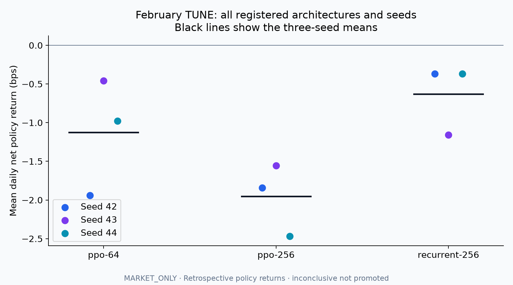
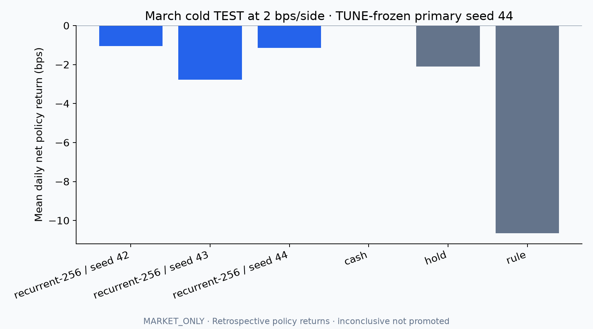
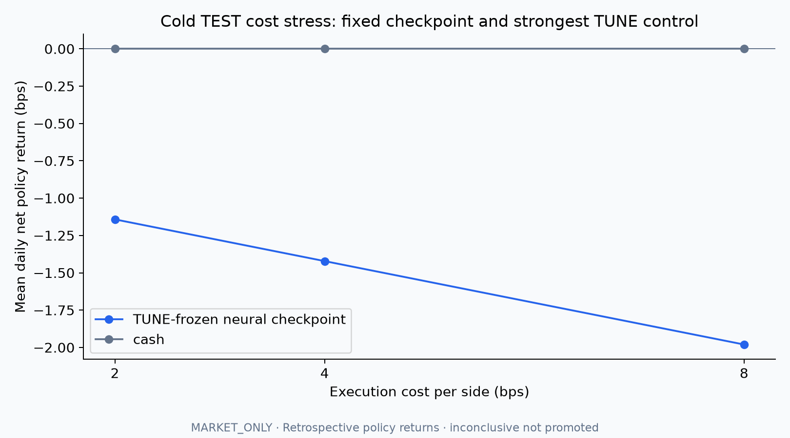

# Offline neural policy evaluation

The user requested real evaluation of the network design. This implements a bounded comparison of small feedforward PPO, larger feedforward PPO and RecurrentPPO, rather than selecting a network from its size alone. Results are trading-policy outcomes in an OHLCV replay simulator; they are not Jev forecast accuracy. Hosted Jev weights are not trained.

## Measured results

**Completed: nine equal-budget runs; recurrent PPO selected on tuning; no policy promoted.** All candidates lost money on average on February. Recurrent PPO was least negative, not profitable or globally optimal.

| February architecture | Mean net return across three seeds (bps/day) | Mean training seconds/seed |
| --- | ---: | ---: |
| PPO 64×64 | -1.125 | 25.3 |
| PPO 256×256 | -1.954 | 33.0 |
| Recurrent PPO 256 | **-0.631** | 465.2 |

These are equal-weight date means across independent $10,000 symbol-day books after 2 bps per-side execution costs. One basis point is 0.01% of starting equity. Each design completed all 92,160 steps for each seed, totaling 829,440 training steps; no seed was stopped or omitted.



February selected recurrent seed44 (tuning -0.366 bps/day), then sealed that choice before March. Cash was the strongest February control. The same March period was used for the selected architecture's other seeds as stability diagnostics; their outcomes did not replace the primary checkpoint.

| March test policy | Net return (bps/day) | Maximum episode drawdown (bps) | Fill count |
| --- | ---: | ---: | ---: |
| Recurrent seed42, diagnostic | -1.058 | 17.50 | 210 |
| Recurrent seed43, diagnostic | -2.783 | 33.56 | 1,055 |
| **Recurrent seed44, frozen primary** | **-1.142** | **17.50** | **289** |
| Cash | 0.000 | 0.00 | 0 |
| Capped intraday hold | -2.106 | 34.84 | 1,122 |
| Fixed five-minute momentum | -10.657 | 34.60 | 6,434 |

The primary's paired 95% date-bootstrap interval versus cash is [-2.824, +0.684] bps/day. Its positive-return, positive lower-bound and doubled-cost improvement requirements failed; the drawdown requirement passed. The report therefore records `inconclusive_not_promoted`. The neural policy lost less than hold/momentum in this cohort, but it did not demonstrate an advantage over cash. All 2,190 scored episodes were valid and resolved; no unfavorable or unliquidated cases were dropped.



With the primary checkpoint fixed, raising costs from 2 to 4 and 8 bps per side changed test means from -1.142 to -1.422 and -1.980 bps/day. Cash remained zero. No architecture, seed or thresholds were adjusted after seeing these results.



A [post-scoring action diagnostic](results/2026-10-03-neural-capacity/policy-actions.json) shows the primary requested half-cap exposure on 16,924 of 17,220 March decisions (98.28%). Seed42 requested half-cap on every decision. Forced exits still occur through the simulator's independent risk rules. This is evidence of mostly simple exposure policies, not a demonstrated selective forecasting signal. It does not change the preregistered winner.

Independent review verified 62 artifact digests, all nine checkpoint/source/lock/data identities, all 2,190 episodes and 359,160 ledger transitions by exact cash/share/cost-basis/realized-PnL/fee/drag/reward reconstruction. Tuning selection and bootstrap/gate calculations matched independently; two fresh saved-checkpoint replays matched complete ledgers exactly. Ruff, strict mypy across 74 source files, 639 full-suite tests plus two renderer fixtures, wheel/sdist builds and the default network-disabled Docker runtime passed. Hosted validation is recorded in [PR #5](https://github.com/Vajraaaang/tradecopilot/pull/5).

Source: Alpaca SIP/raw historical bars under declared replay assumptions. Public [aggregate results](results/2026-10-03-neural-capacity/summary.json) exclude raw bars, daily vectors, individual ledgers and checkpoints. Private report ID: `3b0fee4fe7bba056ab71fffd823e4dc7cbcc0791d304150dddcae85b2d066a21`.

The evidence supports retaining the recurrent design as the best tested development candidate under this budget, while withholding production promotion. A subsequent registered experiment should test eligible out-of-fold forecast inputs and training stability before assuming deeper networks improve accuracy. March outcomes are now consumed; a revised policy requires fresh confirmation dates. No Jev accuracy gain or 80% target is claimed.

## Registered protocol

Registration `5bb6992bed6be525687269c4e0b12c0e962676647cb12b3fd4a79ff41c1de183` was frozen before source acquisition or quality scoring. The previously inspected April–September dates are excluded. Historical SIP/raw minute bars cover AAPL, AMZN, MSFT, NFLX and TSLA. Independent source audit reconciled 413,141 downloaded rows to 195,150 regular-session rows and 217,991 exclusions, verified all 42 acquisition pages and every retained record, and found zero missing regular-session minutes. Availability is assumed at bar end in this retrospective replay; actual acquisition times are retained separately. November 3 is a reference session; November 4–January 30 has 60 training dates, February 2–27 has 19 tuning dates, and March 2–30 has 21 test dates. Dates belong wholly to one split, including all five symbols. Test data is inaccessible through the prepared-data loader until the tuning selection seal exists.

| Candidate | Actor / critic | Parameters |
| --- | --- | ---: |
| PPO 64 | Separate 64→64 networks | 24,964 |
| PPO 256 | Separate 256→256 networks | 198,148 |
| Recurrent PPO 256 | Separate one-layer 256-unit LSTMs, then 256→128 | 986,372 |

All candidates receive the same 127-dimensional observation: 55 market features, their 55 missingness masks, five symbol indicators and 12 ledger/timing fields. Imputation and normalization fit training data only. There are no Jev forecasts or probability features in this MARKET_ONLY experiment.

The architectures have different parameter counts, so this measures the complete candidates rather than isolating the causal effect of recurrence at matched capacity. Two-layer LSTMs and broader optimizer searches were not tested. Equal steps fix data exposure, not equal wall-clock compute or convergence. A single chronological comparison with three seeds cannot establish a globally optimal architecture; rankings may change under longer training or different registered features and optimizer settings.

Each architecture trains seeds 42, 43 and 44 for 92,160 steps (7,200 optimizer epochs) on CPU with the same PPO settings: one environment, rollout/batch 128, ten epochs, learning rate 0.0003, gamma 0.99, GAE 0.95 and clipping 0.2. Each seed is limited to 600 seconds with a process supervisor. Incomplete or unequal-budget runs stop selection instead of receiving a quality ranking. Recurrent state starts at zero, carries within a replay, and resets across symbol/session boundaries.

CPU and MPS throughput probes used only training episodes and discarded their weights. CPU achieved approximately 2,892 / 2,609 / 192 steps per second across the three candidates, versus 241 / 322 / 68 on MPS. Both produced matching deterministic actions and recurrent state on the fixed parity probe. CPU won every throughput comparison on the user's M3 Max / 36 GiB machine. This is a measured local benchmark, not a universal hardware recommendation.

Architecture selection uses average February date-level net return over all three seeds. The checkpoint is the best February seed within the winning architecture. Both choices are hashed before March test scoring. All three seeds of the selected architecture are scored on March alongside cash, capped intraday hold and a fixed five-minute momentum rule. The strongest control is chosen on February, not March. Costs of 4 and 8 bps per side stress the primary checkpoint and that control; base cost is 2 bps.

## Execution and acceptance

Each independent symbol/session starts with $10,000 virtual cash and a $1,000 notional budget. Actions select flat, half or full exposure; repeated nonzero targets hold rather than repurchase. After 60 minutes of past-only warmup, decisions use a common two-minute grid and a full-minute delay before a hypothetical opening fill. Capacity is bounded by 1% of volume known at decision time. Exact Decimal accounting includes adverse fill costs, fee/quantity conventions, partial fills, gap-safe share liquidation and a $100 loss lock. Missing/late mandatory inputs truncate; unresolved positions block improvement claims. These fill/capacity assumptions are synthetic, not verified executable bid/ask liquidity. Revised historical bars, assumed delivery times, raw corporate-action references, the fixed surviving-stock universe and only 21 final-test dates limit generalization.

A successful comparison requires all scored episodes valid and resolved, positive primary test net return, positive paired date-bootstrap lower bounds against cash and the February-selected control, drawdown within the registered limit, and positive incremental return at doubled costs. The simulator's delayed loss lock is not a guaranteed loss bound. All outcomes remain in private ledgers; invalid episodes cannot be silently discarded.

Date-level returns equally average five independently funded symbol episodes and reset capital daily. They do not represent one continuous multiasset brokerage account. Reports preserve turnover, costs, trades and seed variation; no annualized operational profit or 80% forecast-accuracy claim is implied.

## Reproduction

Install the optional neural stack with `uv sync --frozen --group dev --extra rl --extra plots`. The default application and Docker image do not install PyTorch. Prepare verified SIP/raw bars with `scripts/prepare_rl_data.py`, then run `scripts/run_rl_capacity_study.py` with absolute prepared-data, registration, budget and fresh output paths. The public [registration](experiments/rl-capacity-2026-10-03/registration.json), [allocated budget](experiments/rl-capacity-2026-10-03/budget.json) and [device probes](experiments/rl-capacity-2026-10-03/device-probes.json) preserve the pre-scoring choices. The original budget binds the exact private prepared-data identity; a new acquisition needs its own prepared-data hash and a new TRAIN-only benchmark/budget seal. Reproduction dates are now inspected and cannot confirm a revised policy. Raw bars, arrays, individual ledgers and trusted local checkpoints remain private. Registration and budget identities, data/normalizer hashes, package/lock/script digests, versions and checkpoint checksums are verified before tuning and again before locked scoring. `load_report` verifies every saved artifact.

No provider clients, Keychain handles or broker tools enter the rollout path. This experiment spends zero Jev credit and submits no broker orders. A later Jev-feature comparison requires eligible out-of-fold forecast caches and a fresh registered confirmation window.

For a local reproduction, run from the checkout root, use fresh absolute directories, and authenticate Alpaca through the existing Keychain command. The import has the same bounded dates/universe as the registration:

```bash
uv run --no-sync tradecopilot auth alpaca
uv run --no-sync python scripts/download_alpaca_history.py \
  --start 2025-11-03 --end 2026-03-31 \
  --symbols AAPL AMZN MSFT NFLX TSLA \
  --output-dir "$(pwd)/.tradecopilot/rl-reproduce/source"
uv run --no-sync python scripts/prepare_rl_data.py \
  --bars "$(pwd)/.tradecopilot/rl-reproduce/source/bars" \
  --registration "$(pwd)/docs/experiments/rl-capacity-2026-10-03/registration.json" \
  --output-dir "$(pwd)/.tradecopilot/rl-reproduce/prepared"
```

Create a fresh CPU budget using training-only throughput; this discards all probe weights and does not score tuning/test outcomes:

```python
import json, math
from pathlib import Path
from tradecopilot.forecast.contracts import content_hash
from tradecopilot.rl.data import load_prepared
from tradecopilot.rl.training import benchmark_model, registered_config

root = Path.cwd().resolve()
work = root / ".tradecopilot/rl-reproduce"
reg = json.loads((root / "docs/experiments/rl-capacity-2026-10-03/registration.json").read_text())
episodes, manifest = load_prepared(work / "prepared", role="train")
probes = [benchmark_model(c, episodes, registered_config(reg), 42, "cpu") for c in reg["candidates"]]
assert all(p["status"] == "complete" for p in probes)
steps = math.floor(min(100000, 0.8 * 600 * min(p["training_fps"] for p in probes)) / 128) * 128
assert steps >= 10240
budget = {"registration_id": reg["registration_id"], "prepared_data_id": manifest["data_id"],
          "shared_steps": steps, "max_seconds": 600, "device": "cpu",
          "probe_id": content_hash({"cpu_benchmarks": probes})}
budget["budget_id"] = content_hash(budget)
with (work / "budget.json").open("x") as stream:
    json.dump(budget, stream, indent=2)
```

Then run the study without network or inference calls:

```bash
uv run --no-sync python scripts/run_rl_capacity_study.py \
  --prepared "$(pwd)/.tradecopilot/rl-reproduce/prepared" \
  --registration "$(pwd)/docs/experiments/rl-capacity-2026-10-03/registration.json" \
  --budget "$(pwd)/.tradecopilot/rl-reproduce/budget.json" \
  --output-dir "$(pwd)/.tradecopilot/rl-reproduce/study"
```

A new acquisition may contain revised bars and different retrieval/source identities; its hashes and results need not match the original private evidence byte for byte. Keep the same fixed settings for reproduction. Changing a policy or selecting from these already-scored dates is development, not fresh confirmation.
