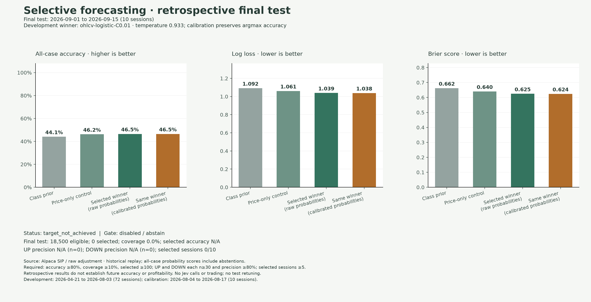
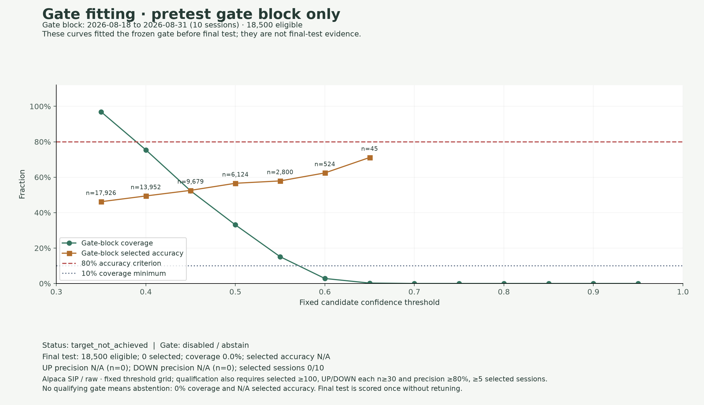

# Selective accuracy experiment — October 3, 2026

**Status: real-data experiment executed; the 80% target was not achieved.** Paper-account credentials were stored locally in OS Keychain and read-only authentication/historical SIP access were verified. No credentials are included in this repository. The frozen experiment used 200,850 regular-session bars over 103 dates; the first date supplied reference warmup, leaving 188,700 labeled cases across 102 dates. No Jev calls or trades were made.

The selected OHLCV logistic model reached **46.51%** all-case accuracy on the 18,500-case September 1–15 final test, versus **46.18%** for the price-only control. No gate qualified on the separate August 18–31 selection block, so the research policy abstains: 0% final coverage and N/A selected accuracy. The prior two-session development percentages describe a different cohort and are not directly comparable.

## What the target means

The experiment seeks 80% accuracy on selected UP/FLAT/DOWN forecasts, with abstentions on the rest. It retains the original five symbols (AAPL, AMZN, MSFT, NFLX, TSLA), 15-minute horizon and ±10 bps FLAT band. A selection rule must meet all of these fixed criteria:

- Selected accuracy at least 80%, covering at least 10% of eligible forecasts.
- At least 100 selected forecasts across at least five sessions.
- At least 30 selected UP and 30 selected DOWN forecasts, each with at least 80% precision.

These criteria prevent a HOLD-only subset from satisfying the goal. UP/DOWN precision measures direction, not profitable BUY/SELL execution. Counts, coverage, per-session/per-symbol scores, all-case accuracy, proper probability scores and a session bootstrap interval remain visible. “Observed target met on test” describes a measured retrospective cohort, not a guarantee of future performance. Failure to qualify produces an all-abstain research policy and `target_not_achieved`; the experiment never lowers the target or promotes a production default automatically.

## Independent chronological stages

At least 100 labeled session dates are required. The last ten dates are reserved for final testing, the preceding ten for selection-rule fitting and the preceding ten for probability calibration. Remaining dates form the development block. All September 16–30, 2026 bars are rejected, including earlier reference/primer bars, because those dates have already informed project experiments.

Within development, three expanding folds validate on five dates each. Each training block includes only earlier dates; overlapping outcome windows are purged at fold and stage boundaries. Imputation and scaling are fitted only on the corresponding training rows. Native/portable OHLCV probabilities are checked on each scored block.

The seven predeclared candidates are:

| Candidate | Changed setting |
| --- | --- |
| Unweighted price-only logistic control | Existing C=1 configuration |
| OHLCV logistic, three variants | C=0.01, 0.1, 1 |
| OHLCV histogram boosting, three variants | L2=1, 10, 50 |

Other settings remain fixed, including no random internal early stopping. Minimum pooled tuning log loss selects the candidate; accuracy and macro F1 are reported too. The winner is refitted only on development. A scalar temperature is fitted on the separate calibration block over 81 fixed values from 0.25 to 4. This can improve probability calibration; it does not change argmax labels or all-case accuracy.

A threshold is then chosen only on the separate selection block, from 0.35 through 0.95 in 0.05 increments. Among qualifying thresholds the highest coverage wins, with deterministic tie-breaking. The full model, temperature and selection rule are saved before test scoring. Nothing is retuned on test outcomes. Existing study directories cannot be reused or overwritten. A fresh confirmation means uninspected dates; it remains retrospective because the experiment design follows earlier studies.

## Acquire larger history without Jev spend

The importer uses only Alpaca's historical stock-bars GET endpoint, with explicit `sip`, `raw` adjustment and `1Min` timeframe. [Alpaca documents](https://docs.alpaca.markets/us/docs/market-data-faq) historical SIP access without a subscription when the query end is at least 15 minutes old. This importer uses an end before the current UTC day. Entitlement errors stop the import; there is no subscription purchase, alternate feed fallback, trading call or paid inference.

The default date range is April 20 through September 15, 2026, inclusive. The first available regular session is a primer for the previous-close proxy; missing minutes remain missing. Limits are five symbols, 366 calendar days, 100 response pages, 20 MiB per page and 500,000 raw rows. Both input and output are bounded and validated. An exclusive end date is translated to an inclusive API timestamp just before that boundary.

Configure credentials through the existing secure prompt; do not put keys in code, command arguments, GitHub or chat:

```bash
uv run tradecopilot auth alpaca
```

Then, from this feature branch:

```bash
uv sync --frozen --all-extras
uv run --no-sync python scripts/download_alpaca_history.py \
  --start 2026-04-20 --end 2026-09-16 \
  --output-dir .tradecopilot/selective/source-01

uv run --no-sync python scripts/run_selective_study.py \
  --bars .tradecopilot/selective/source-01/bars \
  --output-dir .tradecopilot/selective/study-01
```

API credentials are read from OS Keychain, never from the report or browser. Raw response pages and minute bars remain private local research evidence, with SHA256/retrieval/request metadata. Do not commit them. OHLCV closes are assumed available at bar end for replay; actual historic receipt latency is unknown and revised historical data is not a point-in-time feed. Unadjusted corporate actions and the fixed surviving-stock universe are additional limitations. The previous close is the preceding session's last available minute close, not an official auction price.

The run preserves input provenance, dataset, features, models, candidate/fold metrics, frozen stage IDs/settings, calibration, selection curve and final predictions in an integrity-checked private report bundle. The source-bar store is a separate immutable input. Source pages are hashed by the importer; study verification checks the normalized bar store. A report bundle verifies its included artifacts, not the provider's authenticity or historical point-in-time availability.

## Verification and next decision

Tests use mocked API pages and explicitly marked planted fixtures. They exercise pagination/ranges, malformed inputs, sanitized failures, data budgets, missing credentials, causal replay, purging, probability validation, independent stages, no qualifying gate and holdout independence. Changing final-test labels must leave model selection, temperature and the selection rule unchanged. Synthetic reports are marked `synthetic_selective_demo` and cannot be cited as market accuracy.

The completed real run is preserved below, including its failed target and coverage. The observed test dates are now inspected and cannot serve as fresh confirmation for a later revised model or RL policy. Richer Jev inputs remain deferred until this CPU evidence supports a bounded comparison; no new Jev calls or quota changes are part of this milestone. Calibration follows [separate-data guidance](https://scikit-learn.org/stable/modules/calibration.html).

Local verification passed all 575 tests, Ruff and strict mypy across 64 source files,
plus wheel/source-distribution builds. Independent spec and code reviews passed
after boundary, frozen-model and dataset-identity corrections. Hosted validation
is recorded on the pull request. The initial missing-credential attempt was followed by the approved October 3
Keychain setup and successful real-data execution. All 44 raw source-page hashes,
model/selection artifacts, chronological folds and final metrics were independently
verified. Native/JSON inference parity passed across all scored OHLCV blocks.


## Measured final results

Development: April 21–August 3 (72 dates, 133,200 cases). Separate calibration: August 4–17; gate fitting: August 18–31; final test: September 1–15 (each ten dates and 18,500 cases). The three expanding folds selected OHLCV logistic C=0.01 by minimum pooled log loss. Temperature 0.9330329915 was fitted on calibration only. No threshold or model was retuned after final scoring.

| Final-test model | All-case accuracy | Macro F1 | Log loss | Brier |
| --- | ---: | ---: | ---: | ---: |
| Class prior | 44.07% | 0.2039 | 1.091890 | 0.662137 |
| Price-only control | 46.18% | 0.3520 | 1.060764 | 0.640285 |
| Chosen OHLCV logistic, raw | 46.51% | 0.3743 | 1.039092 | 0.624588 |
| Same model, calibrated | 46.51% | 0.3743 | 1.038397 | 0.623945 |

The observed accuracy difference from the control is only 0.32 percentage points. The selected model's 95% session bootstrap accuracy interval is 44.10–48.71%; the control interval is 43.96–48.61%. No statistical-significance or profitability claim is made. Probability scores improved modestly; scalar temperature calibration preserved argmax accuracy.



No predeclared threshold met the 80% accuracy/10% coverage/count/session/both-direction criteria on the gate-fit block. The final deployed-to-replay gate is disabled, yielding zero selected cases and N/A UP/DOWN precision. All-case probability scores remain visible and include abstentions.



At the earlier fixed 0.6 raw-model threshold, 224 final-test cases were selected (1.21% coverage), with 69.64% accuracy. This is a diagnostic of the existing threshold, not a replacement gate or an 80% result. It fails the declared coverage and accuracy goal.

The public [aggregate result](results/2026-10-03-selective-retrospective/derived-results.json) contains scores, settings, splits and source fingerprints. Raw pages, minute bars, feature rows, cases, full predictions and model artifacts remain local. Verified private report ID: `e40b48f80839cfb0a54361a99c3a684b388dbb0da33219b2d2f6e9c614364f6b`.

This provides a measured basis for the next Jev-context or downstream policy experiment. It does not establish improved Jev accuracy. Any RL trading simulator is a future milestone; no RL agent was implemented or trained in this run.
