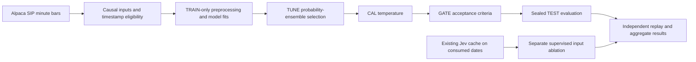
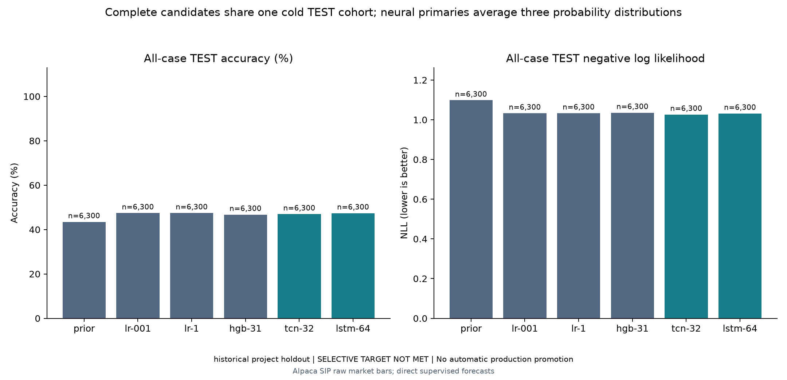
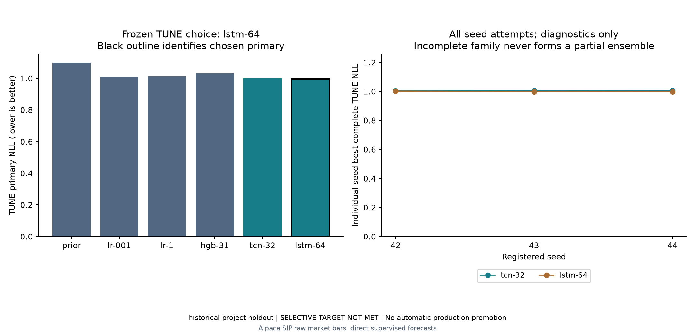
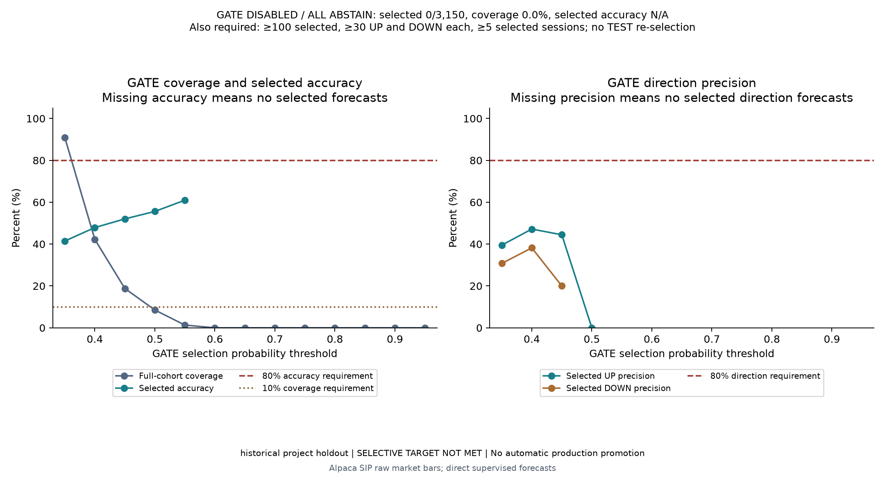
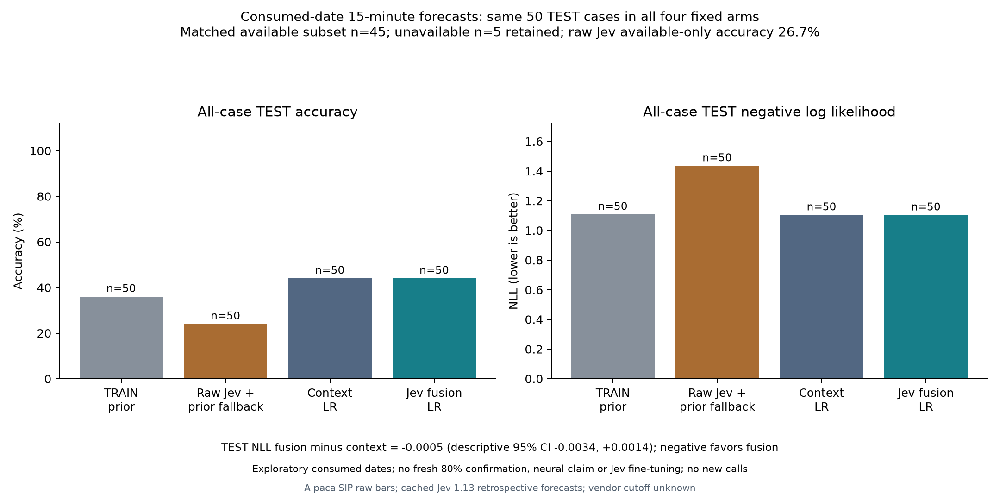

# Direct supervised forecasts and exploratory Jev correction

This milestone trains classifiers directly against price-direction labels. It
keeps the offline RL environment as a separate tool for evaluating trading
policies. PPO training does not update the hosted Jev forecasting model.

The experiment compares a class prior, two logistic models, a stronger histogram
booster, a causal temporal convolutional network (TCN), and an LSTM. A separate
exploratory experiment tests whether a learned classifier benefits from the
already paid Jev probabilities. Neither experiment automatically changes the
live adviser or places orders.

## Fixed target and data

The target is exact minute-close direction after 15 minutes: DOWN below −10 bps,
FLAT from −10 through +10 bps, and UP above +10 bps. These are price-direction
classes; BUY/HOLD/SELL additionally depends on positions, execution and risk.

Use AAPL, AMZN, MSFT, NVDA and TSLA with Alpaca SIP/raw minute bars. January 2,
2025 supplies prior-session references. The following 110 XNYS sessions were
chosen mechanically before inspecting model quality, outside the recorded
previous study periods.

| Role | Dates in 2025 | Sessions | Cases from the timestamp audit |
| --- | --- | ---: | ---: |
| TRAIN | January 3–April 1 | 60 | 18,900 |
| TUNE | April 2–April 15 | 10 | 3,150 |
| CAL | April 16–April 30 | 10 | 3,150 |
| GATE | May 1–May 14 | 10 | 3,150 |
| TEST | May 15–June 12 | 20 | 6,300 |

Two contiguous downloads retain the importer’s existing 500,000 raw-row limit
per download. The merged source retains both parent manifests and all 46 raw
page hashes. Its 455,535 raw rows include 216,450 regular-session bars. The
independent timestamp audit found complete grids and no duplicate or late
minutes under the historical bar-end availability assumption.

Anchors start at session open plus 61 minutes and repeat every five minutes.
Require 61 contiguous completed same-session bars and an exact target bar at
`as_of + 15 minutes`. No interpolation, forward filling, model-specific row drops
or replacement dates are permitted. Every planned anchor and timestamp exclusion
remains in a private catalog, with public aggregate counts.

## Inputs and models

Each neural window contains 60 bars plus a preceding close used as a fixed
reference. The six channels are open/high/low/close basis points relative to
that reference, log-volume, and one-minute close return. Static neural inputs
contain 55 causal OHLCV features, 55 missing-value masks and five symbol indicators.
The CPU models consume the existing 55-feature interface plus symbol indicators.
Thus neural-versus-CPU comparisons include a representation difference; TCN
versus LSTM uses the same inputs.

All preprocessing fits on TRAIN only. Neural inputs impute continuous missing
values with TRAIN means; missing flags and symbol indicators stay binary. CPU
models retain their existing preprocessing and missing-branch artifact contracts.
Input identities bind causal observations and features, while outcome values
cannot rewrite case IDs.

| Candidate | Registered settings |
| --- | --- |
| Class prior | TRAIN class frequencies |
| Logistic models | Unweighted multinomial classification; C=0.01 and C=1 |
| Histogram booster | 100 iterations; learning rate 0.05; up to 31 leaves; depth 6; minimum leaf size 100; L2=10; no early stopping |
| TCN32 | Six-to-32 projection; five single-convolution residual blocks with kernel 3 and dilations 1/2/4/8/16; causal left padding; 20,579 parameters |
| LSTM64 | One unidirectional 64-unit layer; fresh hidden state for every independent window; 24,291 parameters |

Both neural models concatenate the final sequence representation with static
inputs, then use a 32-unit head, ReLU, dropout 0.1 and three output logits.
Training uses CPU float32, one thread, AdamW at 0.001, weight decay 0.0001,
unweighted cross-entropy, batch size 256 and gradient clipping at 1.0.

Each architecture uses seeds 42, 43 and 44 with matched shuffle generators.
Budgets are at most 20 epochs, 1,480 optimizer updates and 600 seconds per seed,
including loading, tuning and checkpoint work. Full TUNE log loss selects the
checkpoint, with a 0.0001 improvement margin and patience four. An incomplete
seed makes its entire family ineligible. A family’s primary prediction averages
all three probability vectors; it is not a best seed or an average of seed scores.

## Selection and claims

TUNE log loss chooses the candidate and CPU reference. The weights remain fixed;
CAL fits one scalar temperature and GATE selects among 13 fixed confidence
thresholds. The existing selective target requires at least 80% accuracy, 10%
coverage, 100 selected cases, five selected sessions, and at least 30 predicted
UP and DOWN cases each with 80% precision. Failure produces all-abstain, zero
coverage and N/A selected accuracy.

TEST outcomes are released through the runner only after model/checkpoint,
normalizer, ensemble, temperature, threshold and reference hashes are sealed.
This is an application integrity guard, not operating-system secrecy. The runner
requires every candidate to cover the exact same ordered case IDs.

Raw selected-primary log loss is compared with the raw TUNE-selected CPU
reference for a model-improvement claim. Calibrated pipeline metrics are reported
separately. The paired 95% interval resamples whole session dates, retaining all
symbols and overlapping windows. A second sensitivity analysis uses consecutive,
nonoverlapping five-date blocks starting at the first TEST date; it resamples the
same four blocks with replacement, 1,000 times at seed 42, and computes ratios
of total case sums to total case counts. No selection or retuning uses TEST.

All candidates, individual seeds, failures, confusion matrices, per-class
precision/recall, balanced accuracy, macro F1, proper probability scores,
coverage and aggregate exclusions remain visible. No result establishes
production profitability or universal model superiority.

## Jev correction on consumed dates

The separate comparison reuses the existing July–October 2025 cache without any
new API calls. Its 400 cases and 60/10/10-session split were already inspected.
They provide exploratory evidence and cannot confirm improvement, select the
fresh January–June models or support an 80% headline.

Four fixed arms use the same cases: TRAIN prior; raw Jev with prior fallback for
unavailable responses; market-context logistic C=0.01; and the same logistic
model with Jev's three probabilities and reported confidence appended. Both
learned arms receive identical availability, status and timing metadata. Missing
Jev fields are zeroed, every failed forecast stays in the cohort, and a matched
available-only comparison is also reported. Confidence is an input rather than
an assumed correctness rate. All scaling and weights fit on TRAIN only.

Jev calls were made today for historical contexts, and vendor pretraining overlap
is unknown. This ablation tests a correction pipeline; it does not fine-tune
Jev's hosted weights or prove the forecasts were available historically.

## Reproduction and artifacts

Install the optional neural dependency with `uv sync --frozen --group dev --extra
neural --extra plots`. All preparation and study CLI path arguments must be
absolute. Use the frozen registration and method registry published beside the
result summary, and your own Alpaca credentials to acquire the registered source
parts. Then run `scripts/prepare_supervised_forecast.py` with `--source-parts`,
`--merged-bars`, `--registration` and `--output-dir`; run
`scripts/run_supervised_forecast_study.py` with `--prepared`, `--registration` and
`--output-dir`. Render with `scripts/render_supervised_results.py`.

The fusion script accepts `--source-bars`, `--old-prepared`,
`--old-registration`, `--cache` and `--output-dir`. It uses the earlier Jev/RL
cache artifacts and requires their optional simulator dependency.

Private artifacts retain licensed bar rows, features, targets, case identities,
probability vectors and safe JSON model weights. Public artifacts contain
aggregate results, hashes, frozen settings and charts. No credentials are
stored in either artifact bundle. Fresh scoring consumes the TEST period for
future model-development purposes; another confirmation requires new dates.

## Measured results

The real run completed on October 4, 2026. All four CPU arms and all six neural
seeds completed under their registered budgets. LSTM64 was selected by TUNE
ensemble log loss; the CPU reference was logistic C=0.01.

| Primary model | TUNE log loss | TEST accuracy | TEST log loss | TEST macro F1 |
| --- | ---: | ---: | ---: | ---: |
| Class prior | 1.099408 | 43.46% | 1.098171 | 0.2020 |
| Logistic C=0.01 (CPU reference) | 1.011326 | 47.44% | 1.032860 | 0.4050 |
| Logistic C=1 | 1.012760 | 47.46% | 1.033440 | 0.4042 |
| Histogram booster 31 leaves | 1.031808 | 46.75% | 1.035786 | 0.4135 |
| TCN32 three-seed probability mean | 1.001743 | 46.95% | 1.026499 | 0.4047 |
| LSTM64 three-seed probability mean (selected) | 0.996893 | 47.40% | 1.031836 | 0.4178 |

All TEST models used the same 6,300 cases across 20 session dates. The selected
LSTM scored 47.40% accuracy (date-bootstrap 95% interval 44.90–49.81%), versus
47.44% for the CPU reference. Its raw log-loss gain was 0.001024, with paired
95% interval −0.001896 to +0.004384. The five-date sensitivity interval also
crossed zero (−0.000032 to +0.001887). **A neural improvement is not established.**

TCN had the lowest TEST log loss, but it did not win TUNE selection. That is a
diagnostic observation, not permission to switch the selected model after TEST.
The CAL-selected temperature was 1.109569; calibrated TEST log loss was 1.035177,
worse than raw 1.031836. Both values remain reported. No gate met the unchanged
80% requirements, so the final research policy selects 0/6,300 cases: 0% coverage
and N/A selected accuracy. No model is promoted.

### Recorded neural budgets

| Architecture | Seed | Completed epochs | Updates | Chosen epoch | Seconds |
| --- | ---: | ---: | ---: | ---: | ---: |
| lstm-64 | 42 | 5 | 370 | 1 | 21.47 |
| lstm-64 | 43 | 5 | 370 | 1 | 21.31 |
| lstm-64 | 44 | 5 | 370 | 1 | 20.48 |
| tcn-32 | 42 | 9 | 666 | 5 | 69.36 |
| tcn-32 | 43 | 5 | 370 | 1 | 42.71 |
| tcn-32 | 44 | 5 | 370 | 1 | 42.23 |

All fits used the registered patience rule; no seed hit a time cap or failed.
These runtimes are recorded execution costs, not a controlled hardware benchmark.

### Exploratory Jev contribution

The old cached TEST block contains 50 cases on ten already consumed dates, with
45 available Jev forecasts. This is separate from the fresh 6,300-case study.

| Fixed arm | All 50 accuracy | Available 45 accuracy | All-case log loss |
| --- | ---: | ---: | ---: |
| TRAIN class prior | 36.00% | 40.00% | 1.107208 |
| Raw Jev with TRAIN-prior fallback | 24.00% | 26.67% | 1.434914 |
| Market-context logistic | 44.00% | 40.00% | 1.103801 |
| Same logistic plus Jev probabilities/confidence | 44.00% | 40.00% | 1.103265 |

Adding Jev changed none of the 50 argmax decisions: both learned arms scored
**44%**. The paired fusion-minus-context log-loss difference was −0.000535, with
descriptive 95% interval −0.003392 to +0.001449. It does not establish a Jev gain.
On available cases, the fusion log loss was slightly worse (1.131958 versus
1.131191). The correction pipeline beat raw Jev, but the same market-only model
achieved that accuracy; the gain cannot be credited to Jev.

This milestone made **zero new Jev calls and spent $0 on Jev**. Cached API failures
remain in the comparison, and no outcomes or thresholds were altered to make
an 80% result. These TEST dates are now retired for future confirmation.

### Evidence and verification

The source timestamp audit covered all 46 raw pages and all 216,450 regular bars.
An independent input audit reconstructed all 34,650 windows, TRAIN scalers, masks,
symbol indicators and input IDs. Float32 arrays matched exactly; 1,650 fixed
static-feature samples covered every stock/date/role and matched their source
dependencies. Separate reviews found and repaired the full-registration and
synthetic-evidence marker defects before fitting.

Independent result replay matched all 81,900 saved TEST probability rows exactly;
recomputed metrics differed by at most 2.22e-16. The fusion replay matched all
400 cases and every metric exactly. The final local suite passed all 870 tests;
Ruff and strict mypy passed. See the [validation record](validation-2026-10-04-supervised.md)
and [aggregate independent audit](results/2026-10-04-supervised-forecast/independent-audit.json).

See [aggregate summary](results/2026-10-04-supervised-forecast/summary.json),
[frozen registration](results/2026-10-04-supervised-forecast/registration.json),
[pretraining clarification](results/2026-10-04-supervised-forecast/pretraining-clarification.json)
and [method/retirement registry](results/2026-10-04-supervised-forecast/method-registry.json).
Private source rows, labeled cases, probability vectors and checkpoints remain local.

Report identity: `20dd12da07716f1878e798fd008cece8558f851a9fe809b583b26fadf4783129`.
Fusion report identity: `3fd82fa91684d2e5c6b8104d31dc0c4b8160b21d510b8e00bb067a68fe70e2b2`.
